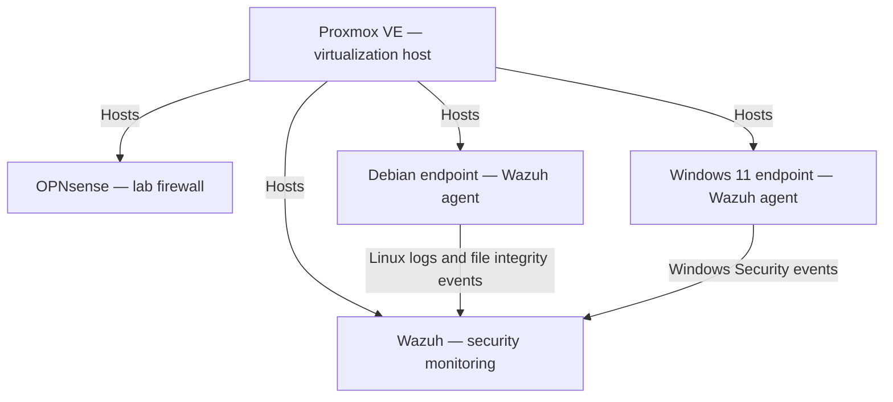

# Proxmox SOC Home Lab

## About This Project

I am an IT support professional building hands-on security operations experience through an isolated home lab.

Using Proxmox VE, OPNsense, and Wazuh, I collect and investigate security events from Debian and Windows endpoints. I have completed seven investigations covering authentication failures, file integrity, account creation and deletion, and Linux group membership.

This repository contains setup notes, investigation evidence, troubleshooting, a custom Wazuh decoder and rule, and documented conclusions. The project is ongoing; completed work and planned additions are listed separately below.

## Start Here

These three investigations show my approach to detection troubleshooting, evidence analysis, and investigation documentation:

| Investigation | What it demonstrates |
| --- | --- |
| [05 — Linux group membership and custom detection](docs/investigations/05-linux-group-membership.md) | Identifying a decoding gap, creating a custom Wazuh decoder and rule, validating positive and negative samples, confirming live alert delivery, and testing group-based file access. |
| [06 — Windows failed authentication](docs/investigations/06-windows-failed-logon.md) | Analyzing event 4625, failure codes, calling process, and event id while while keeping unexplained activity separate from a controlled test. |
| [07 — Windows account creation and deletion](docs/investigations/07-windows-account-creation.md) | Identifying the difference between acting and affected accounts, correlation of incidents 4720 and 4726 with warnings, timeline generation, and account deletion verification.. |

## Current Architecture

The diagram shows the lab components and log flow. It does not represent exact network interfaces, routing, or firewall rules.

## Completed and Running

- Proxmox VE with configured networking, storage, and lab virtual machines.
- OPNsense lab firewall.
- Wazuh with connected Debian and Windows 11 agents.
- Verified Linux and Windows Security event collection.
- Seven completed investigations with evidence and closing assessments.
- Custom Wazuh decoder and rule for the tested Linux usermod group-add message format.

## Planned Additions

The following are planned and are not yet demonstrated as completed work in this repository:

- Windows Server and Active Directory.
- Windows endpoint domain enrollment.
- Sysmon installation and process-event investigations.
- AdGuard Home and Uptime Kuma.
- Additional PowerShell and network activity investigations.

## Completed Investigations

[Investigation 01: Failed sudo authentication in Wazuh](docs/investigations/01-sudo-authentication.md)

I generated a failed sudo authentication on my Debian lab desktop, found the alerts in Wazuh, and checked the original log to confirm what caused them. The write-up includes screenshots, troubleshooting notes, and my conclusion.

[Investigation 02: File integrity monitoring in Wazuh](docs/investigations/02-file-integrity.md)

I created, modified, and deleted a test file on my Debian endpoint, then reviewed the alerts, content difference, and file attributes. The write-up includes nine evidence screenshots.

[Investigation 03: Multiple failed sudo authentication attempts](docs/investigations/03-failed-sudo-attempts.md)

I deliberately entered three incorrect sudo passwords, connected the PAM and sudo logs, and reviewed the level-10 alert. The write-up includes six screenshots and my closing SOC ticket.

[Investigation 04: Linux account creation](docs/investigations/04-linux-account-creation.md)

I created a temporary Linux account, connected the sudo command to the user and group alerts, and verified cleanup. The write-up includes eleven screenshots and my closing assessment.

[Investigation 05: Linux group membership and custom detection](docs/investigations/05-linux-group-membership.md)

I investigated a group membership change, found a decoding gap, and built a custom Wazuh decoder and rule. I verified a live alert and demonstrated the group’s file-access impact. The write-up includes twenty-one screenshots, the detection files, positive and negative validation tests, and my closing assessment.

[Investigation 06: Windows failed authentication](docs/investigations/06-windows-failed-logon.md)

I compared a controlled runas failure with Windows event 4625 and Wazuh alerts. I reviewed distinct event records and kept an unexplained Edge-associated failure separate. The write-up includes eight screenshots and my closing assessment.

[Investigation 07: Windows account creation and deletion](docs/investigations/07-windows-account-creation.md)

I reviewed creation and deletion events for a temporary Windows account, distinguished the acting and affected accounts, and verified cleanup. The write-up includes eight screenshots, troubleshooting, and my closing assessment.

[Windows endpoint setup](docs/setup/windows-endpoint.md)

I installed Windows 11 Enterprise Evaluation, configured VirtIO tools, enrolled the agent, and verified Windows Security event collection. The setup notes include fourteen screenshots.

---

## Why I'm Building This

I've spent most of my professional IT experience working in technical support. While studying cybersecurity has helped me understand many security concepts, I wanted an environment where I could actually apply them.

My goal with this project is to get more comfortable with things like:

- Investigating security alerts
- Reading and understanding logs
- Windows Event Viewer
- Active Directory
- SIEM tools
- Endpoint monitoring
- Basic network analysis
- Documenting an investigation
- Understanding false positives
- Knowing when an alert should be escalated

I also want to become more comfortable explaining how I approached an investigation instead of simply memorizing cybersecurity concepts.

---

## Lab Hardware

The lab runs on an HP EliteDesk Mini with:

- 32 GB RAM
- 1 TB SSD
- Proxmox VE

I already have a separate Debian server running Nextcloud, so I'm keeping the SOC lab separate from my main storage server.

---

## Current Lab

The lab now has four VMs on Proxmox. OPNsense provides the lab gateway, and Wazuh receives events from the Debian and Windows endpoints.

| VM | Role | Current state |
|---|---|---|
| `opnsense-fw` | Lab firewall and gateway | Running |
| `lab-desktop` | Debian endpoint | Wazuh agent enrolled; Linux investigations completed |
| `soc-wazuh` | Ubuntu server with Wazuh manager, indexer, and dashboard | Receives Linux and Windows events |
| `lab-windows` | Windows 11 Enterprise Evaluation endpoint | Wazuh agent enrolled; Windows Security events verified |

The endpoints use the lab bridge `vmbr1`. Windows Server, Active Directory, domain joining, and Sysmon are still planned. [Windows setup evidence](docs/setup/windows-endpoint.md) and [hardware details](docs/Hardware.md) document the current build.

---

## Tools and Technologies

**In use:** Proxmox VE, OPNsense, Debian, Ubuntu, Windows 11 Enterprise Evaluation, Wazuh, PowerShell, and Linux command-line tools. I also built and validated a custom Wazuh decoder and rule for a Linux group-membership message.

**Still planned:** Windows Server, Active Directory, Sysmon, and additional network and endpoint investigations. AdGuard Home and Uptime Kuma remain optional service projects.

---

## SOC Skills I'm Practicing

For each exercise, I generate controlled activity, review the alert and original event, compare it with endpoint output, and write a disposition supported by the evidence.

I'm practicing how to:

- Identify the acting account and the affected user, group, or file.
- Compare timestamps, process names, SIDs, and event record IDs.
- Check whether an alert matches the test or needs a separate investigation.
- Explain why activity is authorized and verify cleanup.
- Record uncertainty instead of filling gaps with assumptions.

---

## Next Investigations

My next exercise is Windows local Administrators group membership. I'll examine who granted membership, which account received it, and how removal is verified. Investigation 08 is pending.

After that, I plan to investigate PowerShell activity, unusual network connections, and endpoint security alerts. Active Directory exercises will follow the Windows Server build.

---

## Project Progress

### Proxmox Setup

- [x] Install Proxmox
- [x] Configure networking
- [x] Configure storage
- [x] Create the lab network

### Basic Services

- [ ] Install AdGuard Home
- [ ] Install Uptime Kuma

### Windows / Active Directory Lab

- [ ] Install Windows Server
- [ ] Configure Active Directory
- [ ] Create Active Directory test users
- [x] Install Windows 11
- [ ] Join Windows 11 to the domain

### SOC Environment

- [x] Install Wazuh
- [x] Enroll the Debian endpoint in Wazuh
- [x] Enroll the Windows endpoint in Wazuh
- [ ] Install Sysmon
- [x] Verify Windows Security event collection
- [x] Collect Linux logs
- [x] Verify alerts are reaching the SIEM

### SOC Practice

- [x] [Investigation #1: Failed sudo authentication](docs/investigations/01-sudo-authentication.md)
- [x] [Investigation #2: File integrity monitoring](docs/investigations/02-file-integrity.md)
- [x] [Investigation #3: Multiple failed sudo authentication attempts](docs/investigations/03-failed-sudo-attempts.md)
- [x] [Investigation #4: Linux account creation](docs/investigations/04-linux-account-creation.md)
- [x] [Investigation #5: Linux group membership and custom detection](docs/investigations/05-linux-group-membership.md)
- [x] [Investigation #6: Windows failed authentication](docs/investigations/06-windows-failed-logon.md)
- [x] [Investigation #7: Windows account creation and deletion](docs/investigations/07-windows-account-creation.md)

---

## What I'm Learning

The biggest change has been learning to explain what the evidence supports, rather than stopping at “an alert appeared.”

- **An alert is a starting point.** I compare its description with the original event and endpoint output. A high severity level does not prove compromise.
- **The acting account and affected account are different roles.** In Windows account events, I check Subject and Target separately. An administrator username identifies a security account; it does not prove the action was approved.
- **Authorization needs context.** I can close my controlled tests because I planned and performed them. In a real environment, I would need to verify the activity against an approved request or with the responsible owner.
- **Alert counts can mislead.** My Windows failed-login test produced distinct event records close together. I checked their record IDs and processes without assuming each alert represented a separate manual attempt.
- **Permissions and actual access are separate questions.** In the Linux group exercise, I tested file access while the user was a member and confirmed a fresh read was denied after removal. That did not prove existing sessions had lost access.
- **Detection gaps need testing.** When Wazuh did not decode a Linux group-membership message, I added a decoder and rule, verified a live alert, and ran positive and negative samples. I documented the detection's limited scope.
- **Cleanup needs evidence.** I check that temporary accounts or files are absent after removal and compare that result with deletion events where available.
- **Troubleshooting belongs in the write-up.** A missing colon, the wrong time range, or an account that already exists can change the result. I keep those screenshots and explain the correction.

Expected lab activity may serve as a legitimate detection in good faith. However, this does not necessarily mean that it constitutes a false positive. Additionally, the unexplained Edge authentication failure was isolated from the actual lab activity..

---

## Future Ideas

Once I complete more investigations in the current environment, I'd like to explore Microsoft Sentinel, Microsoft Defender, vulnerability scanning, and threat hunting. I also want to evaluate the lab's network controls and expand detection coverage as I add systems.

---

## Security

This is an isolated home lab used for learning and testing.

I will not include passwords, API keys, authentication tokens, personal information, or other sensitive information in this repository.

Any screenshots added to the project will be reviewed and sanitized before being uploaded.

---

## Disclaimer

Everything in this repository is being performed in my own lab environment for educational and defensive cybersecurity purposes.
