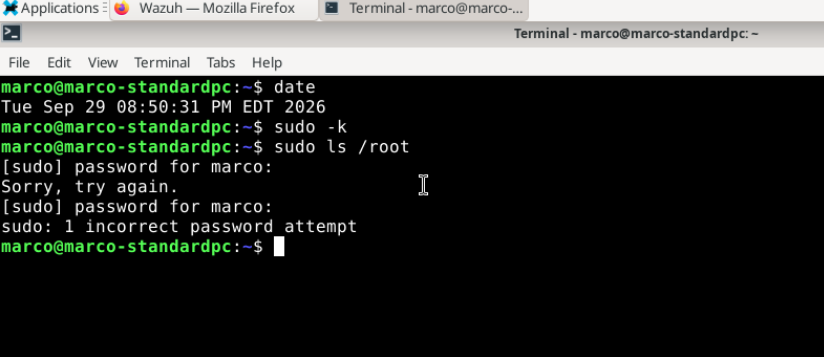
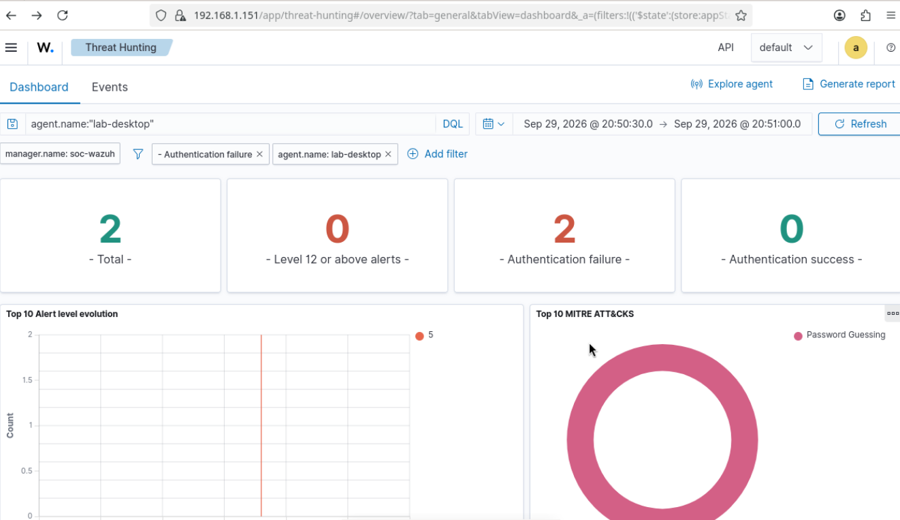
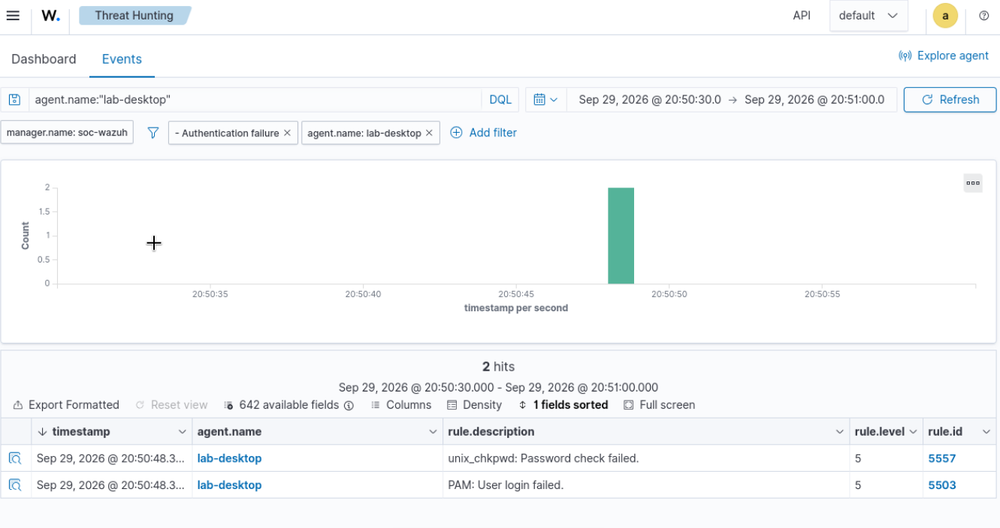
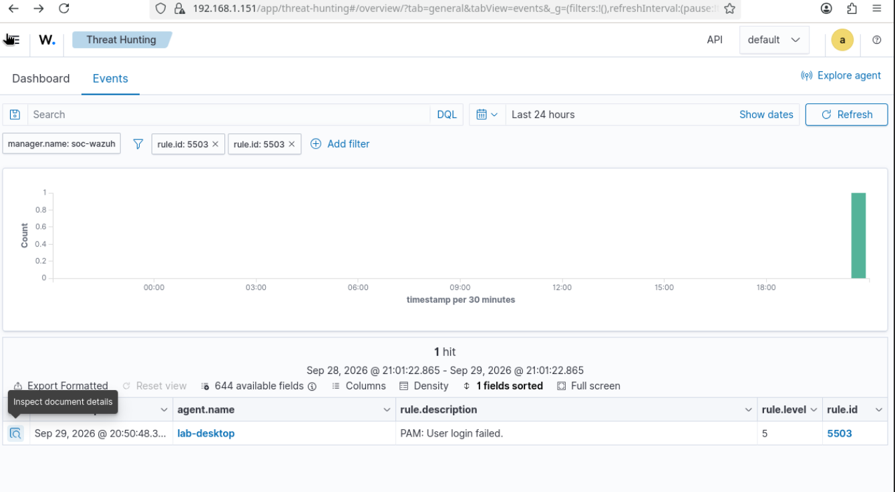
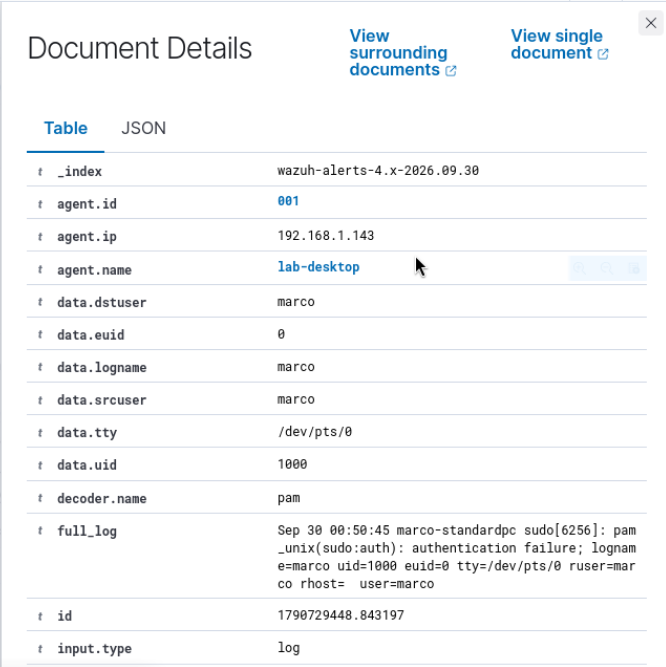
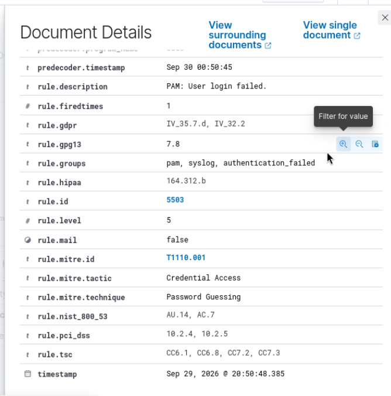

# Investigation 01: Failed sudo authentication in Wazuh

**Date:** September 29, 2026  
**Environment:** My Proxmox SOC home lab  
**Outcome:** Expected authentication failure from an authorized lab test

## What I wanted to test

After connecting my Debian desktop to Wazuh, I wanted to confirm that an authentication failure would reach the dashboard and that I could trace the alert back to the original log.

This was my first investigation in the lab. I deliberately entered an incorrect sudo password on my own VM. I did not run a brute-force tool or target another system.

## Lab systems

| System | Role |
|---|---|
| Proxmox | Hosts the lab VMs |
| OPNsense | Lab firewall and gateway |
| soc-wazuh | Ubuntu Server VM running the Wazuh central components |
| lab-desktop | Debian desktop with Wazuh agent 4.14.8 |

The endpoint's Linux hostname is `marco-standardpc`; its Wazuh agent name is `lab-desktop`. These are the same VM. The screenshots show private lab IP addresses and the lab account name.

## Test steps

On the Debian desktop, I ran:

```bash
date
sudo -k
sudo ls /root
```

`sudo -k` cleared the cached sudo authentication so the next command would ask for a password. I entered an incorrect password and canceled the next prompt with Ctrl+C.

The terminal screenshot records `Tue Sep 29 08:50:31 PM EDT 2026` before the test and `sudo: 1 incorrect password attempt` afterward.



In Wazuh, I opened **Threat Hunting → Events** and searched for:

```text
agent.name:"lab-desktop"
```

I narrowed the time range around the test and opened the individual alert details to inspect `full_log`.

## What Wazuh detected

| Rule ID | Description | Rule level |
|---|---|---|
| 5557 | unix_chkpwd: Password check failed. | 5 |
| 5503 | PAM: User login failed. | 5 |

The filtered view contained two alerts around 20:50:48. Two alerts do not necessarily mean two password attempts: different parts of the authentication process can produce related logs.





## Evidence I reviewed

The original log in rule 5503 was:

```text
Sep 30 00:50:45 marco-standardpc sudo[6256]: pam_unix(sudo:auth): authentication failure; logname=marco uid=1000 euid=0 tty=/dev/pts/0 ruser=marco rhost= user=marco
```

| Evidence | My interpretation |
|---|---|
| `sudo[6256]` | The event came from the sudo process. |
| `pam_unix(sudo:auth)` | PAM was authenticating a sudo request. |
| `authentication failure` | Authentication failed. |
| `user=marco`, `ruser=marco` | The event involved my lab account. |
| `tty=/dev/pts/0` | A terminal session was recorded. |
| `rhost=` | No remote host was recorded in this event; this alone does not establish how the terminal session originated. |
| `euid=0` | The authentication process had an effective UID of 0. This does not mean my failed request successfully gained root access. |

The dashboard displayed September 29 at 20:50:48.385, while the raw log showed September 30 at 00:50:45 without a timezone. This is consistent with UTC logs and an America/New_York dashboard display, but I would verify timezone settings before relying on the difference for precise timing.





## Rule mapping and conclusion

Rule 5503 included the MITRE ATT&CK mapping **T1110.001 — Password Guessing**, under **Credential Access**. That describes a behavior the rule can help detect. It does not prove that this event was an attack.



The account, sudo service, and timing were consistent with my deliberate test. I classified this as **expected test activity: a genuine authentication failure with a benign cause**. I did not treat it as evidence of compromise or change the rule to suppress it.

This confirmed that authentication events from this endpoint were reaching Wazuh and producing searchable alerts. It does not establish coverage for every log source or attack technique.

## Problems I worked through

- The agent service did not exist because installation had not completed.
- Pasting introduced extra terminal control characters, so I split the download and installation into separate commands.
- Debian was missing `wget`, which I installed before downloading the package.
- The package needed `lsb-release`; resolving that dependency allowed configuration to finish.
- After starting the service, I confirmed both the local service status and the endpoint's **Active** status in Wazuh.

## What I learned

An Active agent is a useful connectivity check, but generating a test event gave me evidence that authentication logs were actually being collected and analyzed.

I also learned the difference between opening a rule definition and opening an individual alert. The rule explained why Wazuh matched the event; the original log gave me the account, process, and terminal details needed to investigate it.

In a real investigation, I would also check surrounding failures and successes, other affected accounts, session origin, and whether the user expected the activity before deciding whether to escalate.
