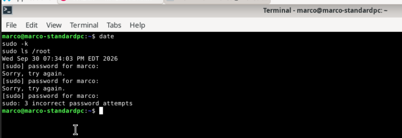
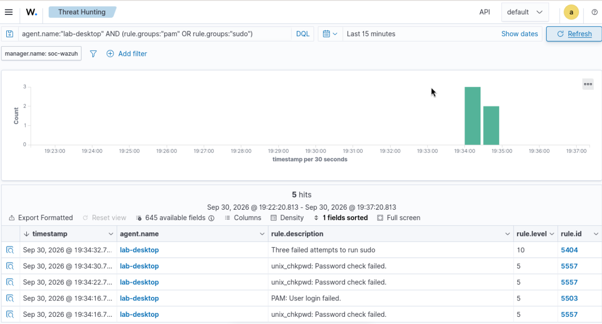
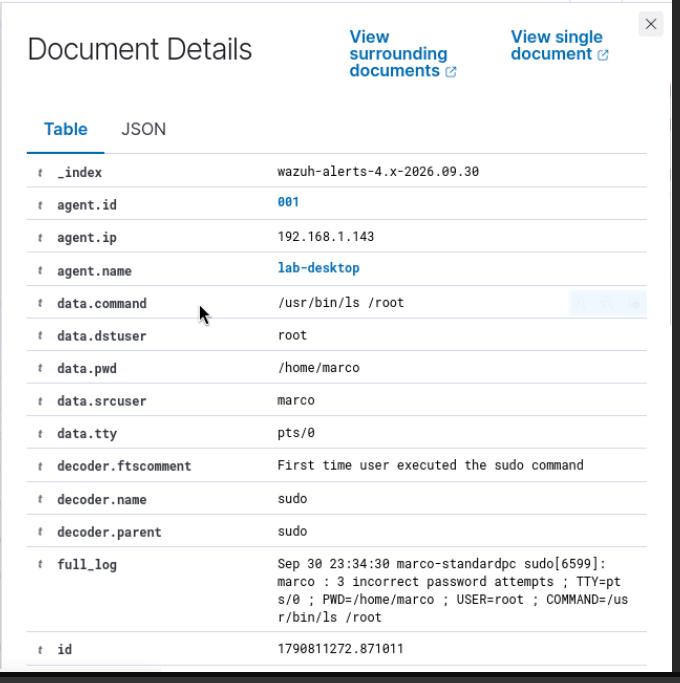
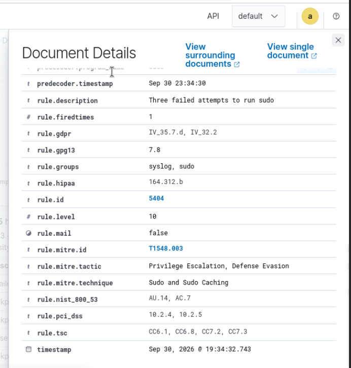
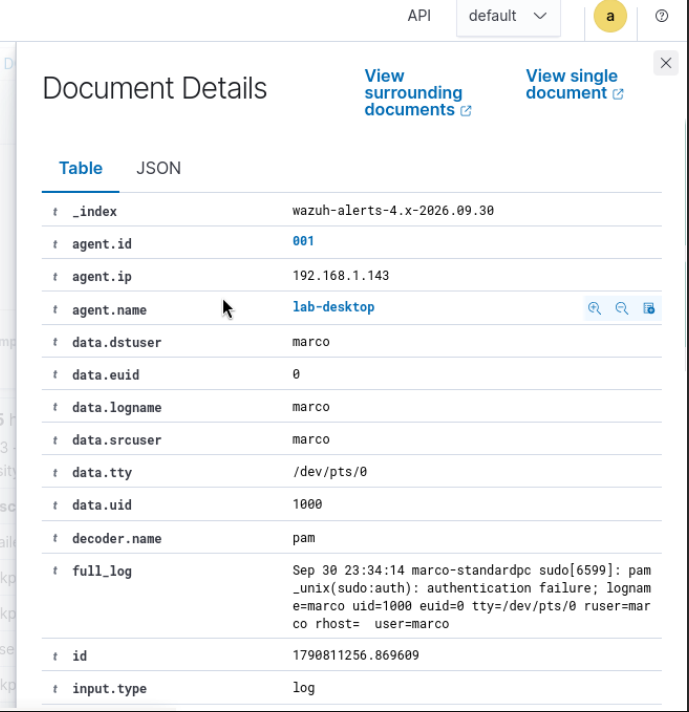
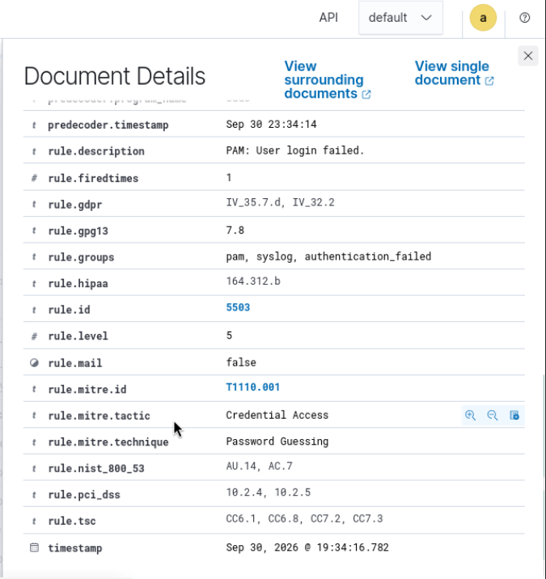

# Investigation 03: Multiple failed sudo authentication attempts

**Date:** September 30, 2026  
**Status:** Complete — closed as expected, authorized lab activity.

## Test

I ran `date`, `sudo -k`, and `sudo ls /root` on my Debian lab desktop and deliberately supplied three incorrect passwords. The terminal displayed `Wed Sep 30 07:34:03 PM EDT 2026` before the test and ended with `sudo: 3 incorrect password attempts`.



## Initial evidence

I searched Wazuh Threat Hunting using:

```text
agent.name:"lab-desktop" AND (rule.groups:"pam" OR rule.groups:"sudo")
```

The filtered results show five alerts for `lab-desktop` around 19:34:16–19:34:32 (dashboard display times, fractional seconds truncated):

| Rule | Description | Level | Visible count |
| --- | --- | --- | --- |
| 5557 | unix_chkpwd: Password check failed. | 5 | 3 |
| 5503 | PAM: User login failed. | 5 | 1 |
| 5404 | Three failed attempts to run sudo | 10 | 1 |



The terminal confirms three failed password attempts. The five alert records must not be treated as five independent attempts. The activity was intentional and authorized for this lab. The level-10 alert alone does not establish compromise or a successful privileged command.

## Original sudo log

The next screenshot identifies agent `001`, IP `192.168.1.143`, source user `marco`, target user `root`, working directory `/home/marco`, terminal `pts/0`, and attempted command `/usr/bin/ls /root`. The original log reads:

```text
Sep 30 23:34:30 marco-standardpc sudo[6599]: marco : 3 incorrect password attempts ; TTY=pts/0 ; PWD=/home/marco ; USER=root ; COMMAND=/usr/bin/ls /root
```



This matches the controlled terminal test. `USER=root` is the requested target account, not evidence of successful root access. The original sudo record itself reports three incorrect password attempts; the alert count alone is not the basis for that conclusion. The decoder comment about a first sudo execution does not override the explicit failure recorded in the log. The raw log time has no timezone suffix; its four-hour offset from the EDT terminal and dashboard times is consistent with UTC, pending timezone verification.

## Rule details and PAM correlation

Rule 5404 is level 10, with dashboard timestamp `19:34:32.743`. Its mapping is `T1548.003`, Sudo and Sudo Caching, with Privilege Escalation and Defense Evasion tactics. These labels do not establish successful privilege escalation.



The PAM original log reads:

```text
Sep 30 23:34:14 marco-standardpc sudo[6599]: pam_unix(sudo:auth): authentication failure; logname=marco uid=1000 euid=0 tty=/dev/pts/0 ruser=marco rhost= user=marco
```



Both original records identify host `marco-standardpc`, process `sudo[6599]`, user `marco`, and terminal `pts/0` (shown as `/dev/pts/0` in PAM). The PAM failure at raw log time 23:34:14 precedes the sudo summary at 23:34:30 by 16 seconds. These shared details tie the records to the same sudo invocation. The PAM `euid=0` describes process context and does not prove the attempted command succeeded. A blank `rhost` does not establish session origin.

Rule 5503 is level 5, timestamp `19:34:16.782`, and maps to `T1110.001`, Password Guessing, under Credential Access. Despite the generic title “User login failed,” the original log specifically identifies `sudo:auth`.



## Assessment supported by the evidence

The evidence supports three intentionally failed password entries during one sudo invocation, producing multiple alert records. Rule 5404 reports the failure summary contained in the original sudo log; it should not be described as proof that Wazuh independently counted three separate login sessions. The controlled test explains the activity, and the supplied terminal shows authentication failure rather than successful execution of `/usr/bin/ls /root`. No confirmed compromise is demonstrated by these screenshots.

## My closing ticket

**Summary:** Wazuh rules 5503 (level 5) and 5404 (level 10) reported failed sudo authentication on `lab-desktop`.

**Verification:** My terminal shows three incorrect password attempts. The PAM and sudo logs share the same host, user, terminal, and process ID, connecting the records to the same test.

**Authorization:** I deliberately entered the wrong password three times during this lab exercise. The observed failures match the action I performed.

**Disposition:** Closed as expected, authorized activity. No escalation was needed for this controlled test. Wazuh correctly detected the failures, so I treated this as a valid detection of benign activity rather than a false positive.

## What I learned

I learned to separate the number of alerts from the number of password attempts and to compare the original logs before reaching a conclusion. A level-10 alert deserves attention, but severity alone does not establish a compromise. The command target, process context, and MITRE mappings also need to be interpreted alongside the actual authentication result.

All six screenshots supplied for this investigation are included above.
