# Investigation 04: Linux account creation

**Date:** October 1, 2026  
**Status:** Complete — closed as expected, authorized lab activity.

## My test

I checked that `soc-lab-user` was not returned by `getent passwd`, then ran:

```bash
date
sudo useradd -M -U -s /usr/sbin/nologin soc-lab-user
id soc-lab-user
getent passwd soc-lab-user
sudo passwd -S soc-lab-user
```

The terminal date before creation was `Thu Oct 1 11:17:02 AM EDT 2026`. Verification returned UID `1001`, primary group `soc-lab-user` with GID `1002`, and only that group in the displayed membership list. The account record selects `/usr/sbin/nologin`; password status is `L` (locked). The record contains `/home/soc-lab-user`, but this field alone does not establish that the directory exists; the creation command used `-M` to skip creating a home directory.

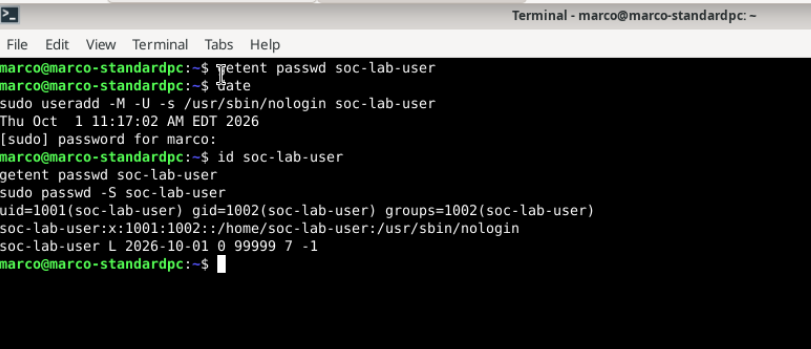

## Initial Wazuh results

The visible list contains these creation-time alerts for `lab-desktop`:

| Dashboard time | Rule | Level | Description |
| --- | --- | --- | --- |
| 11:17:10.062 | 5402 | 3 | Successful sudo to ROOT executed. |
| 11:17:10.064 | 5901 | 8 | New group added to the system. |
| 11:17:10.066 | 5902 | 8 | New user added to the system. |

PAM session open/close records are also visible. A later sudo event appears at 11:17:36.064, and earlier session-close records appear at 11:10:32.038. The screenshot contains ten hits, but that count is not ten account creations. The search field is outside the captured area. I reviewed the sudo and account-management logs below to identify the commands involved. The PAM titles alone do not establish that the new test account logged in.

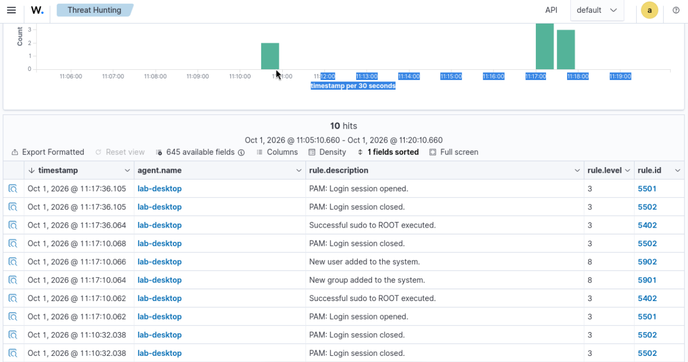

## Account creation log and rule

The useradd record on agent `001`, `lab-desktop` (`192.168.1.143`), confirms the new account details:

```text
Oct 01 15:17:06 marco-standardpc useradd[12305]: new user: name=soc-lab-user, UID=1001, GID=1002, home=/home/soc-lab-user, shell=/usr/sbin/nologin, from=/dev/pts/1
```

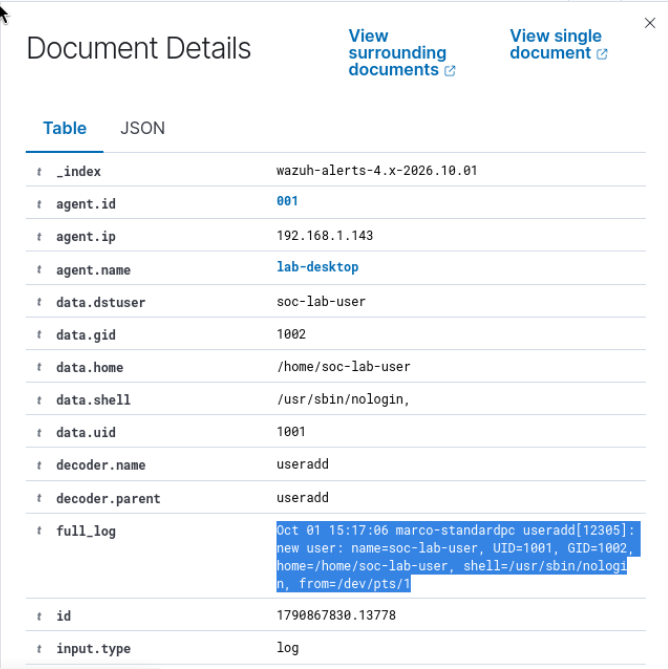

Rule `5902` is level `8`, with dashboard timestamp `Oct 1, 2026 @ 11:17:10.066`. It maps to `T1136`, Create Account, under Persistence. This classification does not establish malicious persistence; the account creation was an authorized test. The raw log has no timezone suffix; its time is consistent with a four-hour offset from the EDT terminal, but the source timezone has not been independently checked.

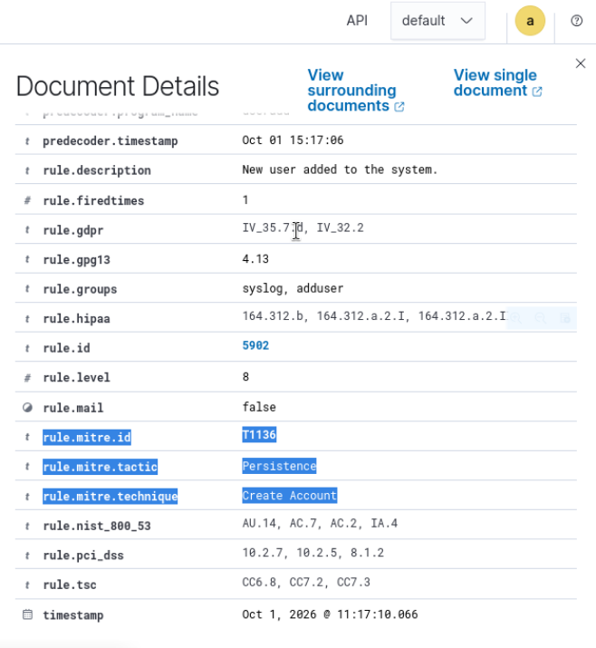

## Distinguishing account creation from verification

The next supplied sudo screenshot shows a different command: `/usr/bin/passwd -S soc-lab-user`, run by `marco` as `root`, from `/home/marco`, terminal `pts/0`. Its raw log timestamp is `Oct 01 15:17:32` and process is `sudo[12314]`. This is the password-status check performed after creation, not the `useradd` command and not a password change. It is consistent with the later 11:17:36.064 sudo alert in the event list.

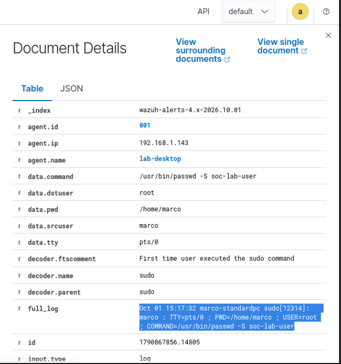

The creation-time sudo record was reviewed next, as documented below.

## Connecting the creation command and group record

The creation-time sudo log identifies `marco` invoking the following command as `root`, from `/home/marco`, terminal `pts/0`:

```text
Oct 01 15:17:06 marco-standardpc sudo[12300]: marco : TTY=pts/0 ; PWD=/home/marco ; USER=root ; COMMAND=/usr/sbin/useradd -M -U -s /usr/sbin/nologin soc-lab-user
```

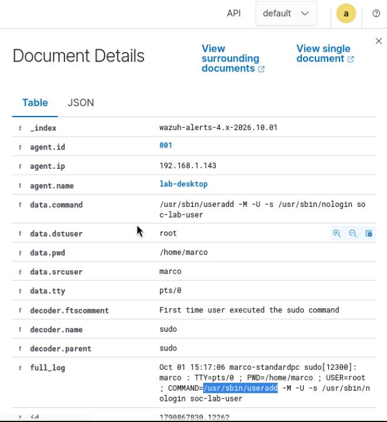

The group record reads:

```text
Oct 01 15:17:06 marco-standardpc useradd[12305]: new group: name=soc-lab-user, GID=1002
```

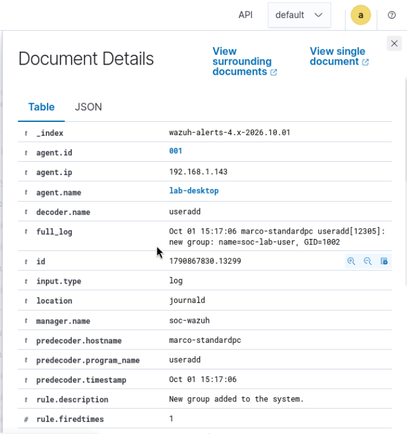

The matching hostname, timestamp, account name, and command connect the sudo record with the account-creation activity. The group and user records share process `useradd[12305]` and GID `1002`, consistent with the `-U` option. The sudo process has a different PID (`12300`), so I do not describe these as the same process. The recorded terminals differ (`pts/0` in sudo and `/dev/pts/1` in useradd); this difference alone does not establish a separate actor or login, and these logs do not show a process tree.

## Cleanup and verification

I ran `date` and `sudo userdel soc-lab-user`. The pre-deletion terminal time was `Thu Oct 1 11:43:32 AM EDT 2026`. Afterward, `getent passwd soc-lab-user` returned nothing, `id soc-lab-user` returned “no such user,” and `getent group soc-lab-user` returned nothing. Both the test account and its matching group were absent; no separate `groupdel` command was needed.

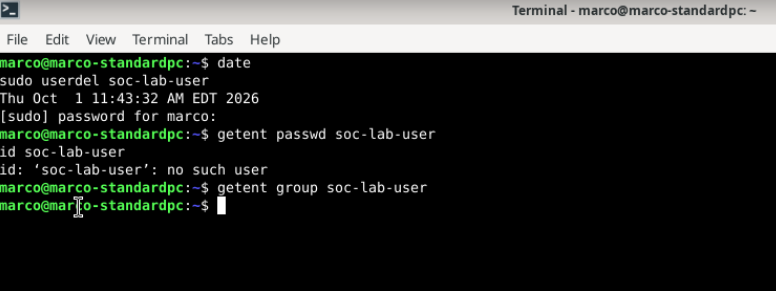

The endpoint-only search shows four records around 11:43:42: sudo rule 5402, PAM session rules 5501 and 5502, and deletion rule 5903. Rule 5903 is level 3, with dashboard timestamp `11:43:42.260`.

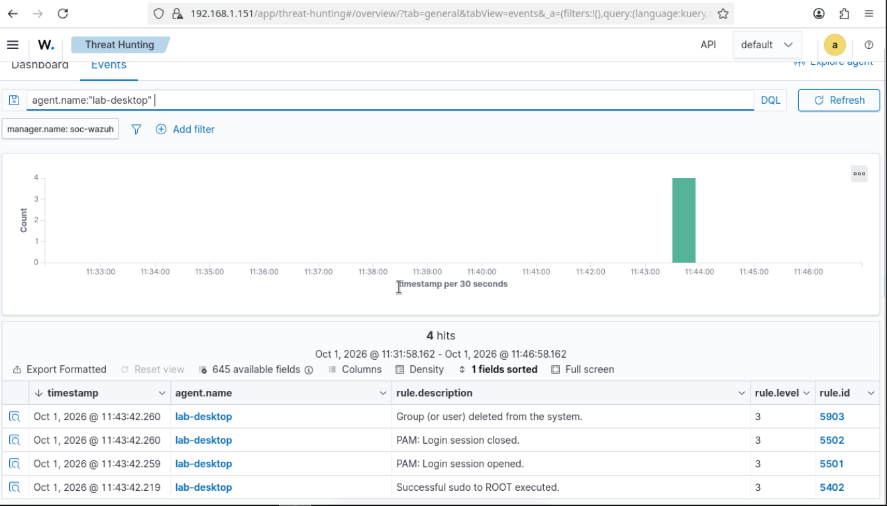

Narrowing the search to `agent.name:"lab-desktop" AND full_log:"soc-lab-user"` returns two records: the sudo event and the deletion event. The screenshots use slightly different time windows, but both include the cleanup sequence. These counts represent alert records, not numbers of deleted accounts.

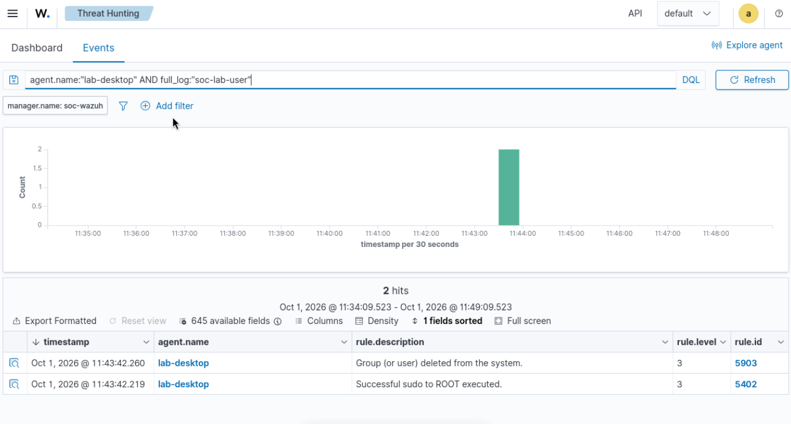

The original deletion log states:

```text
Oct 01 15:43:39 marco-standardpc userdel[12633]: delete user 'soc-lab-user'
```

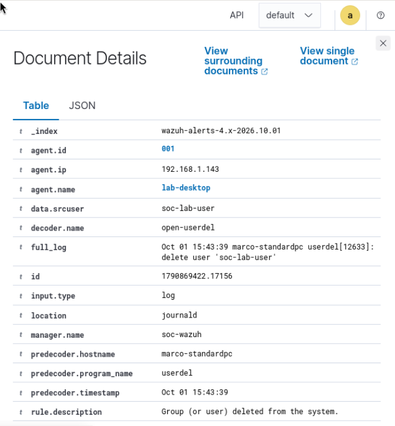

Although rule 5903 has the generic description “Group (or user) deleted from the system,” this original log specifically records user deletion. The group's absence is established separately by the terminal check. The decoded `data.srcuser` field contains `soc-lab-user`, but the original message identifies that name as the deleted account; it does not show that the account deleted itself or identify the invoking administrator.

All eleven supplied screenshots are preserved unchanged.

## My closing ticket

**Summary:** I created the account `soc-lab-user` and its matching group on `lab-desktop`. Wazuh recorded account creation under rule 5902 and group creation under rule 5901, both level 8.

**Authorization:** I intentionally performed this activity as part of my lab test. The sudo log shows that `marco` invoked the creation command as root. Under normal circumstances, knowing which user ran a command would not establish authorization by itself; I would check the approved change or confirm the business reason.

**Cleanup verification:** After deleting the account, `getent passwd soc-lab-user` returned no output and `id soc-lab-user` returned “no such user.” `getent group soc-lab-user` also returned no output, confirming the matching group was gone. Wazuh rule 5903 and the original `userdel` log support the account deletion.

**Disposition:** Closed as expected, authorized lab activity. The test produced the expected results and cleanup was verified. No escalation was necessary. This was a valid detection of benign activity.

## What I learned

I practiced connecting an administrative command to the account and group changes it caused. I also learned why I need to read the original log: a password-status check is different from a password change, and a decoded username can identify the affected account rather than the administrator who performed the action. Alert severity and MITRE mappings help prioritize review, but the evidence and authorization context determine whether I should escalate.
