# Investigation 05: Linux group membership changes

**Date:** October 1, 2026  
**Status:** Complete — closed as expected, authorized lab activity.

## Setup and baseline

I checked that the names `soc-group-user` and `soc-lab-readers` were available, then created the temporary account and group:

```bash
date
sudo useradd -M -U -s /usr/sbin/nologin soc-group-user
sudo groupadd soc-lab-readers
id soc-group-user
getent group soc-lab-readers
```

The pre-creation terminal time was `01:20:53 PM EDT`. The new user had UID `1001` and primary GID `1002` (`soc-group-user`). Initially, `id` showed only that primary group, and `soc-lab-readers` (GID `1003`) had an empty member list.

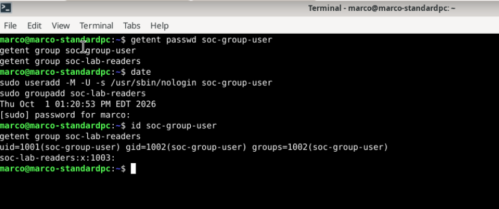

## Membership change

At a terminal date check of `01:23:07 PM EDT`, I ran:

```bash
sudo usermod -aG soc-lab-readers soc-group-user
id soc-group-user
getent group soc-lab-readers
```

The results show supplementary membership in GID `1003` (`soc-lab-readers`) while preserving primary GID `1002`. The group record now explicitly lists `soc-group-user`.

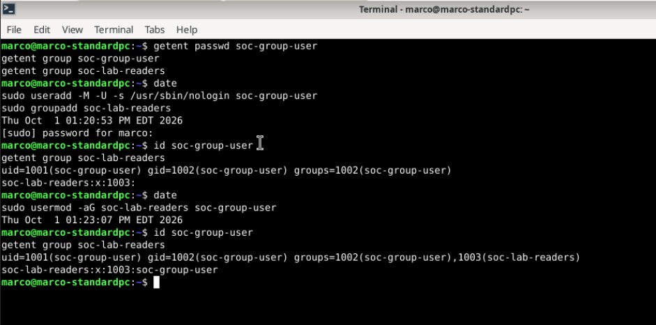

## Initial Wazuh search

I searched:

```text
agent.name:"lab-desktop" AND full_log:"soc-group-user"
```

The visible list contains four hits: rules 5901 and 5902 at `13:21:08.819`, a sudo rule 5402 at `13:21:08.805`, and a later sudo rule 5402 at `13:23:10.818`. I reviewed the later sudo record below to confirm the membership command. The displayed list does not include a dedicated group-membership-change alert. The creation alerts do not establish detection of the later membership change.

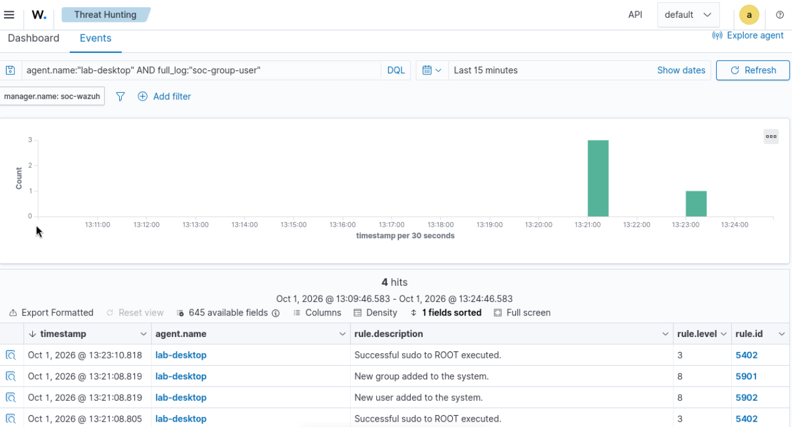

## Command and local membership logs

The sudo alert identifies `marco` invoking `/usr/sbin/usermod -aG soc-lab-readers soc-group-user` as root, from `/home/marco`, terminal `pts/0`. The original timestamp is `Oct 01 17:23:07`, process `sudo[14771]`.

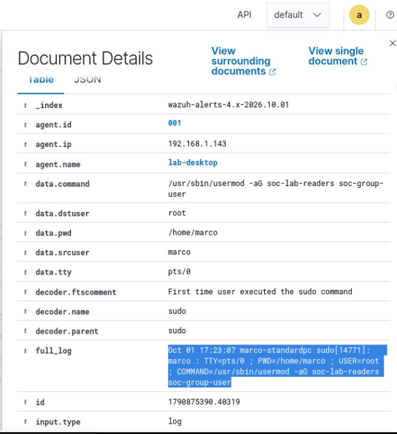

The broader result list shows sudo rule 5402 and PAM session rules 5501 and 5502 around 13:23:10. No dedicated membership-change alert is visible in this captured list. This does not yet establish why such an alert is absent.

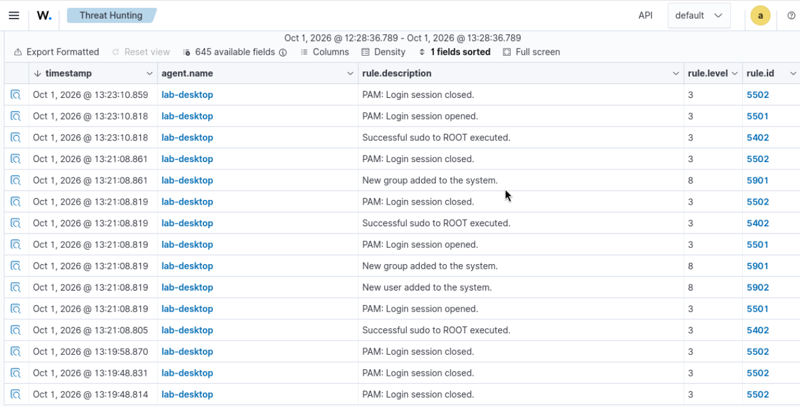

After correcting a typo (`--no-pagers` to `--no-pager`), I ran:

```bash
sudo journalctl -t usermod --since "1 hour ago" --no-pager
```

The local journal shows:

```text
Oct 01 13:23:07 marco-standardpc usermod[14774]: add 'soc-group-user' to group 'soc-lab-readers'
Oct 01 13:23:07 marco-standardpc usermod[14774]: add 'soc-group-user' to shadow group 'soc-lab-readers'
```

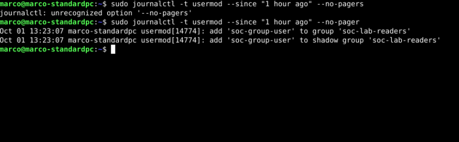

The terminal membership checks and local journal confirm the change. Wazuh also recorded the invoking sudo command. At this stage, I had not established receipt or alerting for the usermod records, so I checked collection and rule matching separately. The group and shadow-group records describe related updates for the same named group, not two different access grants.

## Testing the membership log against the installed ruleset

On `soc-wazuh`, I ran `sudo /var/ossec/bin/wazuh-logtest` (version 4.14.8) and entered the local journal record:

```text
Oct 01 13:23:07 marco-standardpc usermod[14774]: add 'soc-group-user' to group 'soc-lab-readers'
```

Phase 1 extracted the timestamp, hostname `marco-standardpc`, and program name `usermod`. Phase 2 reported `No decoder matched.` No Phase 3 rule match appears in the screenshot.

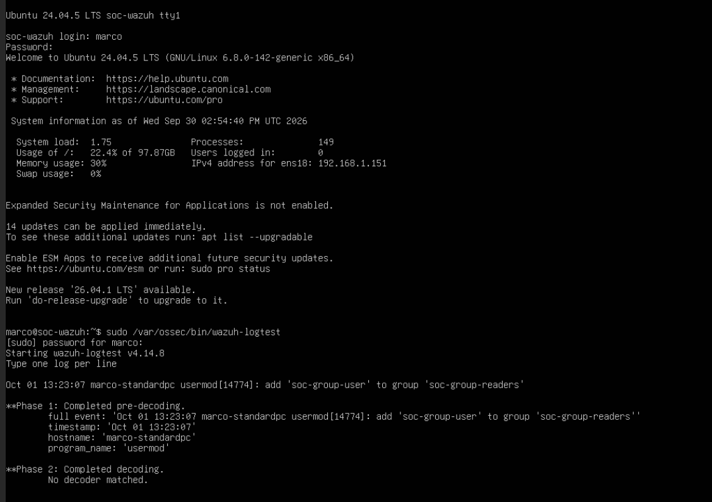

This establishes a decoding gap for this exact sample in the installed log-test configuration. It does not prove whether the original usermod journal record reached the manager. I next inspected the installed definitions and collection configuration before adding a decoder.

## Checking configuration scope

I searched the manager's shipped decoder and rule directories for `usermod`. The only visible result is an unrelated Windows `UserModePowerService` rule. This literal search found no Linux usermod-specific definition; the earlier log test is the direct evidence that the sample did not match a decoder. The screenshot also preserves a harmless failed command where `ls` was used with a sed expression before the corrected commands.

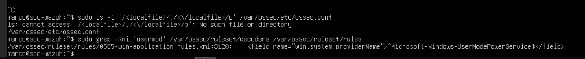

The next image shows a listing of shipped rule filenames. It does not establish the contents of the custom decoder and rule directories under `/var/ossec/etc`.

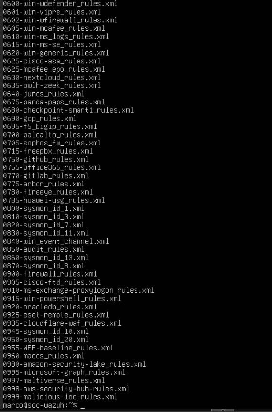

The localfile output includes an unfiltered journald block, but the prompt is `marco@soc-wazuh`: this is the manager configuration, not the Debian endpoint configuration. It therefore does not verify collection of the endpoint's usermod messages. I corrected the scope of the check in the next step.

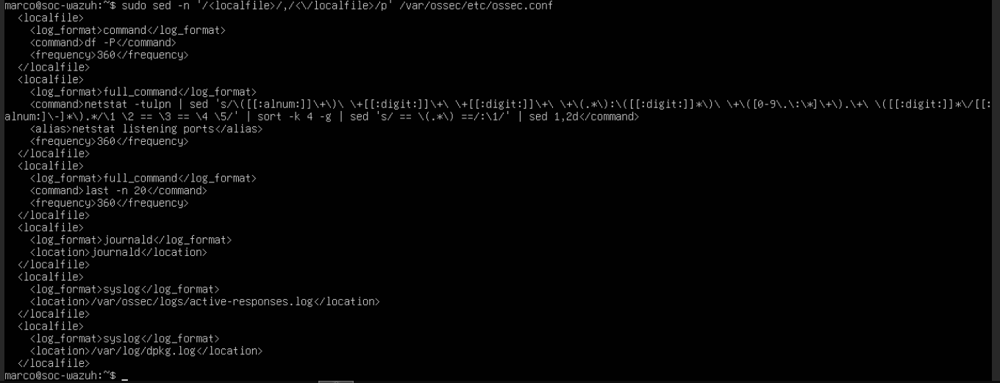

## Endpoint collection configuration verified

The manager custom directories contain `local_decoder.xml` and `local_rules.xml`; their contents have not been inspected. The Debian prompt `marco@marco-standardpc` confirms the next configuration output came from the endpoint. Its localfile configuration includes `<log_format>journald</log_format>` and `<location>journald</location>`, with no filters visible in that block. This supports collection being configured for the local journal, but is not proof that a particular event reached the manager. The screenshot also records one incorrect sudo password followed by successful access; any associated failure alert should be distinguished from the membership test.

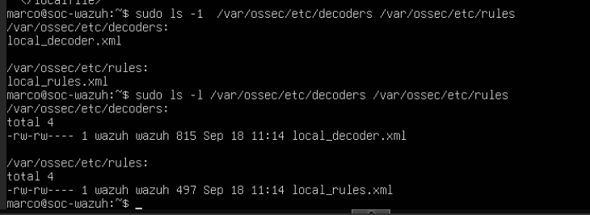

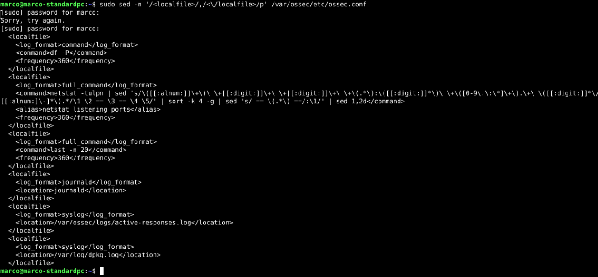

I then prepared a dedicated decoder and rule for the observed message format.

## Clipboard workaround: SSH client missing

To use the working Debian clipboard while administering the manager, I tried `ssh marco@192.168.1.151` from `marco@marco-standardpc`. Both attempts returned `bash: ssh: command not found`. This shows the client command was unavailable on the Debian endpoint; it does not indicate a server connection refusal or an authentication failure. The suggested fix was to install `openssh-client`. This screenshot documents the error; installation and connection output were not captured. The later screenshots show the commands running on `soc-wazuh`.

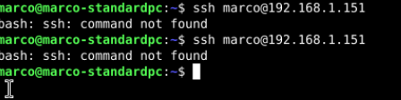

## Custom decoder and rule validated locally

On `soc-wazuh`, the search for rule ID `100105` returned no matches. I created dedicated files `soc_usermod_decoder.xml` and `soc_usermod_rules.xml` in the custom decoder and rule directories, leaving the existing local files in place. The decoder matches program `usermod` and the regular group-add message, extracting `dstuser` and `lab_group`. The rule is ID `100105`, level `5`, with group `linux_group_changes`. The pattern intentionally excludes the separate shadow-group record.

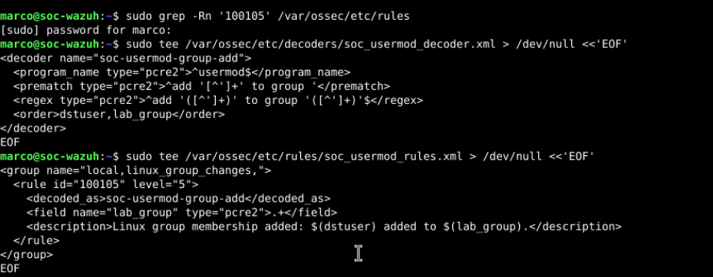

After setting ownership to `root:wazuh` and mode `640`, I started a fresh `wazuh-logtest` session. For the original group-add sample, Phase 2 now reports decoder `soc-usermod-group-add`, `dstuser: soc-group-user`, and `lab_group: soc-lab-readers`. Phase 3 matches rule `100105`, level `5`, with description “Linux group membership added: soc-group-user added to soc-lab-readers.”

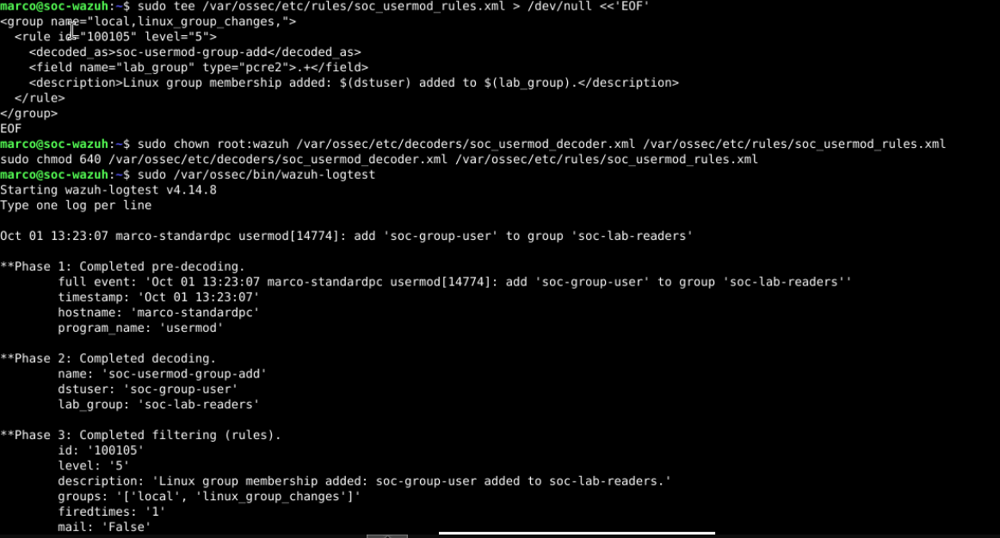

This validated local parsing and rule matching. I then checked live dashboard delivery separately.

## Live detection confirmed

The dashboard search `agent.name:"lab-desktop" AND rule.id:"100105"` returns one alert at `Oct 1, 2026 @ 14:08:09.128`, level `5`, describing `soc-group-user` being added to `soc-lab-readers`.

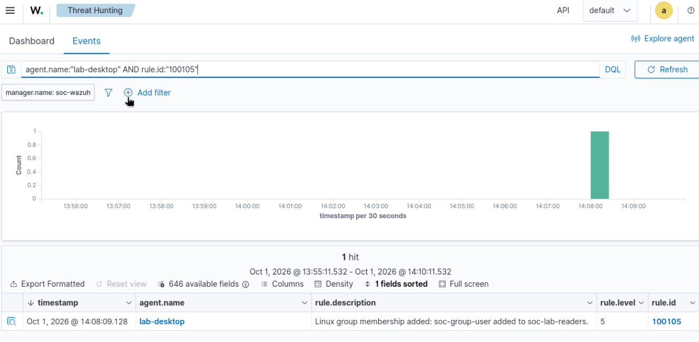

The event identifies agent `001` (`lab-desktop`, `192.168.1.143`), location `journald`, decoder `soc-usermod-group-add`, `data.dstuser: soc-group-user`, and `data.lab_group: soc-lab-readers`. Its original log is:

```text
Oct 01 18:08:05 marco-standardpc usermod[15363]: add 'soc-group-user' to group 'soc-lab-readers'
```

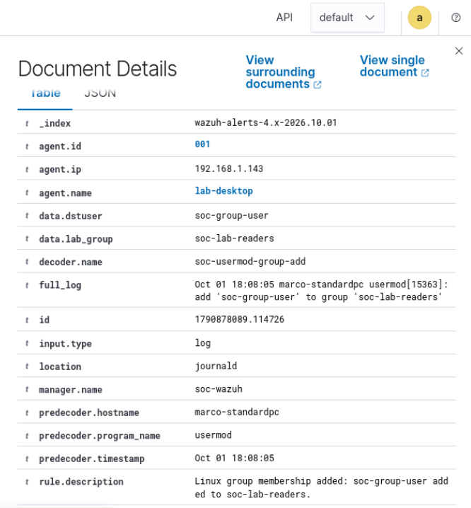

This confirms live journal collection, decoding, rule matching, and dashboard delivery for a fresh membership event. It goes beyond the earlier manually supplied log test. The restart and membership removal/re-addition terminal output was not supplied in this batch, so the event itself is the captured evidence for live detection. The custom rule covers this usermod group-add format; it does not establish coverage for every account-management tool, removal, or direct file edit.

## Verifying the access impact

On Debian, I created a temporary file with `mktemp`, wrote harmless test text, assigned ownership `root:soc-lab-readers`, and set permissions to `640` (`-rw-r-----`). The file was readable by its owner and group, with no permissions for others.

Running `sudo -u soc-group-user cat "$lab_file"` while the account belonged to `soc-lab-readers` successfully printed `SOC lab: group-based access confirmed`. I then ran `sudo gpasswd -d soc-group-user soc-lab-readers` after a terminal date check of `Thu Oct 1 02:22:39 PM EDT 2026`. The following `id` output showed only the primary group. A new `sudo -u soc-group-user cat "$lab_file"` invocation returned `Permission denied`.

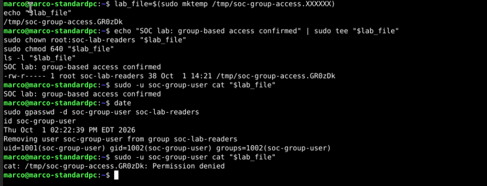

This demonstrates that supplementary membership granted read access to this group-readable file, and that a newly launched process lost that access after membership removal. It does not establish revocation of group credentials in processes already running. The test invoked a command through sudo; it did not enable interactive login for the account. The removal used gpasswd, which is outside the custom rule's usermod-add scope.

## Cleanup confirmed

I removed the temporary file with `sudo rm -- "$lab_file"`; the following `ls` returned `No such file or directory`. I deleted `soc-group-user` with `userdel` and `soc-lab-readers` with `groupdel`. The account lookup and both group lookups returned no output, while `id soc-group-user` returned `no such user`. This confirms the temporary file, account, private group, and access group were removed.

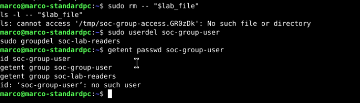

The custom decoder and rule are retained on the manager for future monitoring. All twenty-one supplied screenshots are preserved.

## My closing ticket

**Activity:** I added the user `soc-group-user` to the group `soc-lab-readers` on `lab-desktop` as part of an authorized lab exercise.

**Detection:** Initially, Wazuh recorded the sudo command, but no dedicated membership alert was visible. The log test reported “No decoder matched.” I added a custom decoder and rule 100105, then verified both the local log test and a live level-5 alert with the correct user and group. This closed the observed decoding gap for this message format.

**Impact:** The user could read a group-readable test file while in the group. After removing the membership, a fresh command returned “Permission denied.” This demonstrated the access granted by the group without granting administrator privileges.

**Disposition and cleanup:** Closed as expected, authorized lab activity; no escalation needed. The temporary file check returned “No such file or directory,” the user check returned “no such user,” and the account and group lookups returned no output. The custom detection remains installed.

## Detection files and scope

The repository includes the configuration used in this test:

- [Custom decoder](configs/05-linux-group-membership/soc_usermod_decoder.xml) — installed at `/var/ossec/etc/decoders/soc_usermod_decoder.xml` on the manager.
- [Custom rule](configs/05-linux-group-membership/soc_usermod_rules.xml) — installed at `/var/ossec/etc/rules/soc_usermod_rules.xml` on the manager.

These copies match the configuration shown in the screenshots. The decoder extracts the affected account as `dstuser` and the group as `lab_group`; it does not identify the administrator who initiated the change. For that, I correlated the sudo log.

The rule matches the regular `usermod` group-add message for any matching username and group, not just this test pair. It excludes the shadow-group companion message. This lab verified the original positive sample, a live event, an alternate-user positive sample, and two negative samples. It did not exhaustively test removals, other tools, or direct edits to group files. Level 5 is the severity I selected for the lab, not proof of the change's business impact.

## What I learned

A change can happen and appear in local logs without producing the specific SIEM alert I expect. I learned to check collection, decoding, rule matching, and dashboard delivery separately. I also practiced correcting command mistakes, distinguishing server settings from endpoint settings, and testing actual access rather than assuming what a group name allows.

The terminal uses EDT, while raw Wazuh event times show a consistent four-hour difference without an explicit timezone suffix. I retained the displayed times and did not treat the offset as an event delay.

## Follow-up: positive and negative detection tests

I used `wazuh-logtest` to check three simulated records. The sample timestamp `Oct 01 16:30:00` is test input, not evidence that these accounts existed or these changes happened. No accounts or memberships were created by these tests.

| Sample | Expected result | Observed result | Assessment |
| --- | --- | --- | --- |
| `usermod` adds `test-analyst` to `test-readers` | Rule 100105; alternate names extracted | Decoder `soc-usermod-group-add`; correct `dstuser` and `lab_group`; rule 100105, level 5 | Passed |
| `usermod` adds the same user to the shadow group | No rule 100105 | No decoder matched; no rule 100105 shown | Passed |
| `example-app` emits the regular group-add text | No rule 100105 | No decoder matched; no rule 100105 shown | Passed |

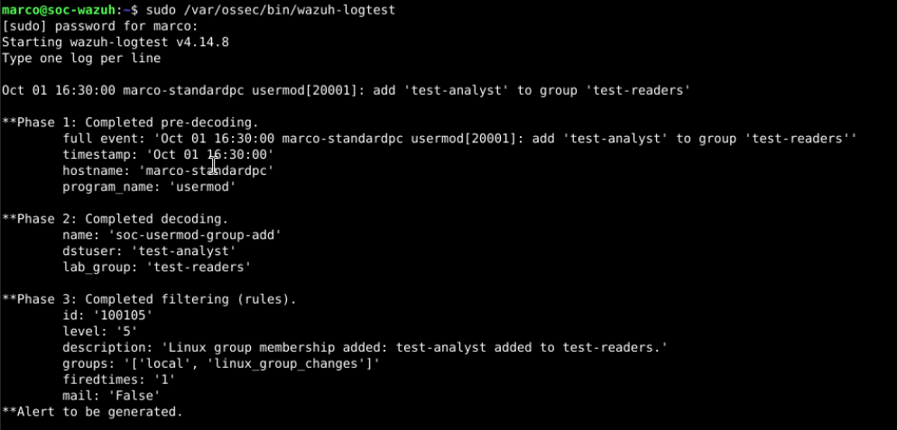

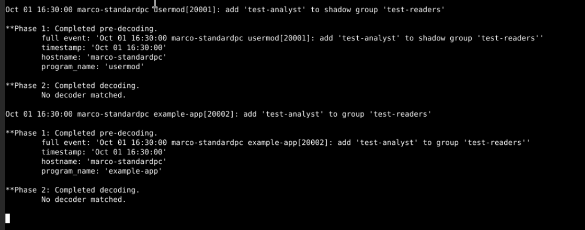

The positive test shows the extraction is not limited to the original lab names. The two negative samples confirm that the tested shadow-group companion message and an unrelated program do not trigger the custom rule. These are scoped checks, not proof of zero false positives or complete detection coverage. The log-test message “Alert to be generated” describes the simulated rule result; live dashboard delivery was established separately by the earlier real event.
