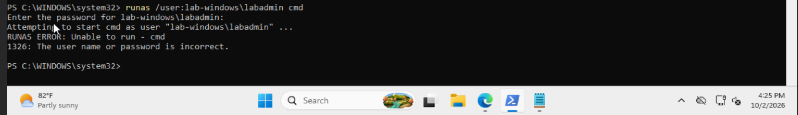
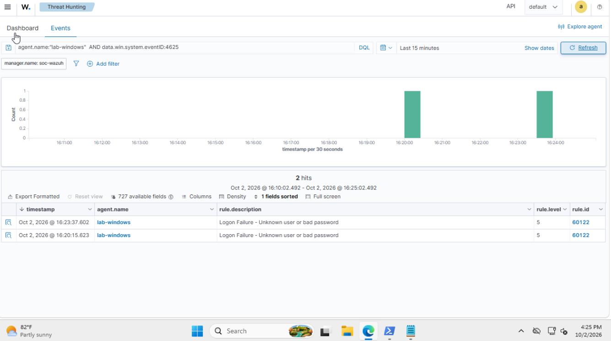
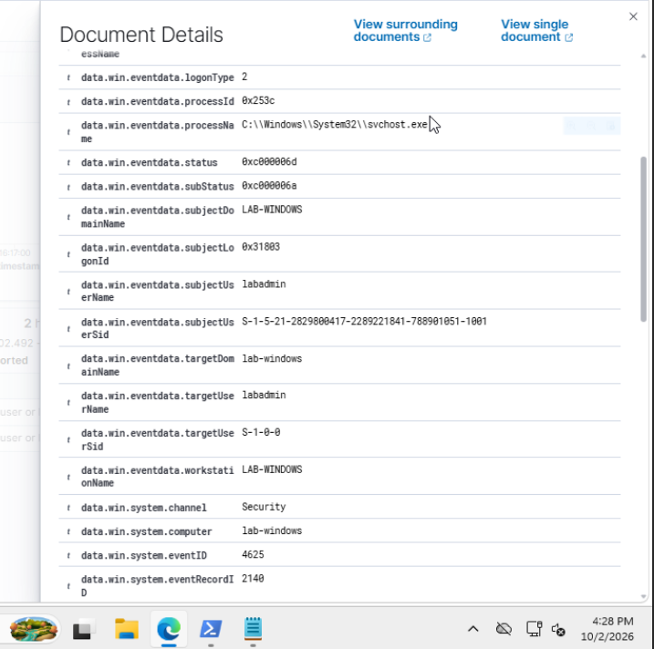
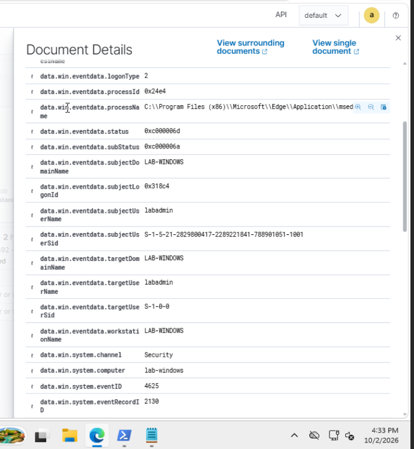
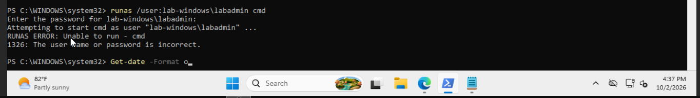
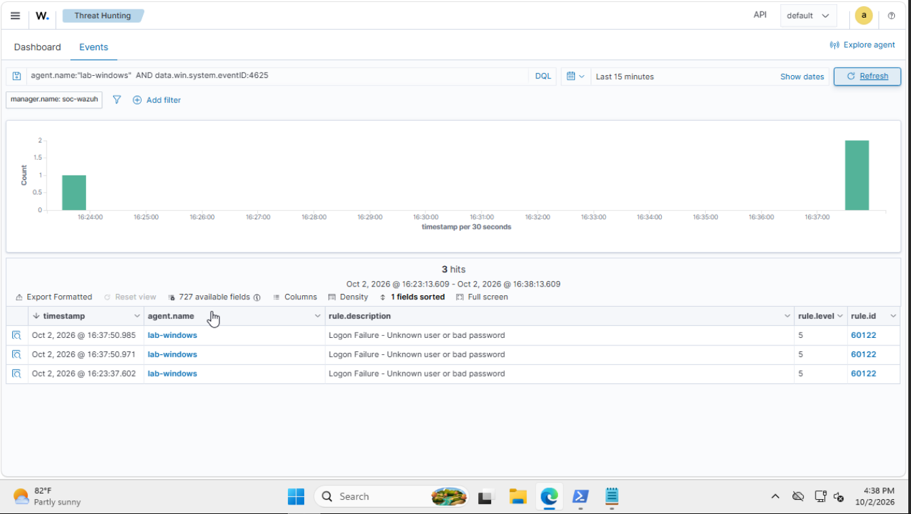
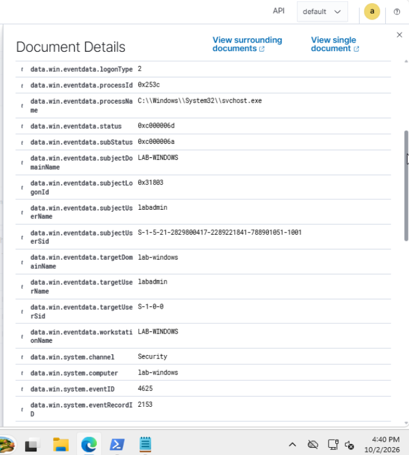
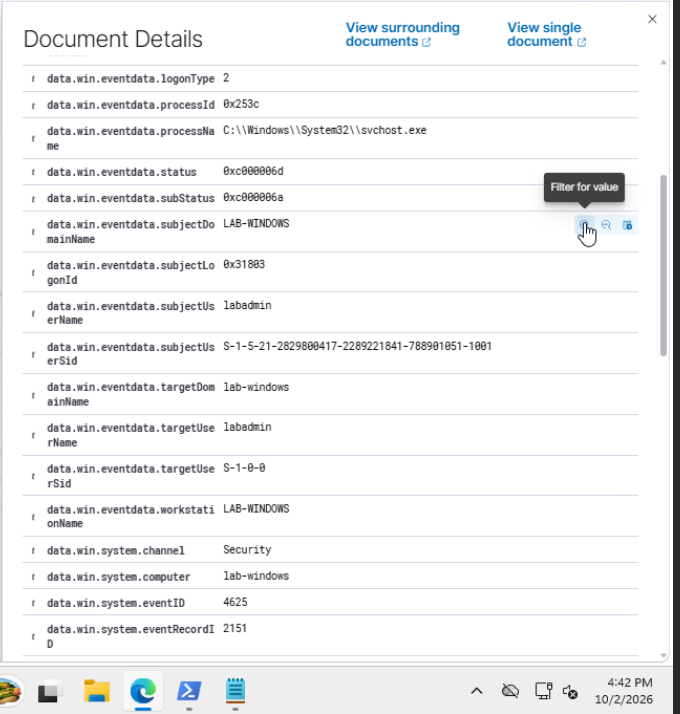

# Investigation 06: Windows failed authentication

**Date:** October 2, 2026  
**Endpoint:** `lab-windows` (Wazuh agent `002`)  
**Target account:** `LAB-WINDOWS\labadmin`  
**Disposition:** Close the controlled test activity as expected and authorized. Keep the earlier Edge-associated failure separate because its cause is unconfirmed.

## What I investigated

I deliberately supplied an incorrect password to `runas` on my Windows lab endpoint, then compared the terminal error with Windows Security events in Wazuh. I reviewed the account, caller process, failure codes, and event record IDs rather than treating every nearby alert as part of my test.

## How I worked through it

### 1. Check that Windows events are reaching Wazuh

My Windows agent was Active, and I verified received Windows events using:

```text
agent.name:"lab-windows" AND data.win.system.eventID:*
```

The initial search needed a colon before the asterisk. After fixing it, I found Windows logon events, including event 4624. My [Windows setup notes](../setup/windows-endpoint.md) include the setup and event-collection screenshots.

I ran `auditpol /get /subcategory:"Logon"` in an elevated PowerShell window. The output showed Success and Failure auditing enabled, so I did not change the policy. That screenshot contained a credential and is excluded from the public evidence.

### 2. Generate a controlled failure

I ran this command and intentionally entered an incorrect password at the hidden prompt:

```powershell
runas /user:lab-windows\labadmin cmd
```

The terminal returned error 1326: “The user name or password is incorrect.” The command did not start the requested shell.



### 3. Find the Windows alerts

In Threat Hunting → Events, I selected Last 15 minutes and searched:

```text
agent.name:"lab-windows" AND data.win.system.eventID:4625
```

Wazuh displayed alerts at 16:20:15.623 and 16:23:37.602, both rule 60122, level 5: “Logon Failure – Unknown user or bad password.” Times here are the dashboard display times on October 2, 2026.



### 4. Compare the nearby events

The 16:23 event targeted `labadmin` and named `C:\Windows\System32\svchost.exe` as the caller process. Its event record ID was 2140.



The earlier 16:20 event also targeted `labadmin`, but its caller path pointed to Microsoft Edge. Its event record ID was 2130. I could not recall the exact time of my first command, so I did not claim that both events came from it. The cause of this earlier Edge-associated failure remains unconfirmed.



### 5. Repeat the test and inspect the new records

I repeated the controlled incorrect-password attempt and captured another error 1326. I had intended to bracket the command with `Get-Date -Format o`, but the screenshot only shows a date command still at the prompt, with no timestamp output. The taskbar shows 16:37; this provides approximate timing rather than an exact command timestamp.



The refreshed search showed two new alerts at 16:37:50.971 and 16:37:50.985, plus the older 16:23 event. The 16:20 event had fallen outside the moving 15-minute window.



### 6. Check the account, failure codes, and record IDs

The two new records shared these fields:

| Field | Observed value |
|---|---|
| Computer | `lab-windows` |
| Target user | `labadmin` |
| Windows event ID | `4625` |
| Channel | `Security` |
| Logon type | `2` (Interactive) |
| Caller process | `C:\Windows\System32\svchost.exe` |
| Caller process ID | `0x253c` |
| Status | `0xc000006d` (authentication failure) |
| Substatus | `0xc000006a` (incorrect password) |
| Wazuh rule | `60122`, level `5` |





Record IDs 2151 and 2153 establish that these are distinct Windows event records. They do not establish two manual attempts. Their timing and matching fields are consistent with the repeated test, but I did not establish why Windows generated the pair or independently trace the service process to `runas`.

### 7. Write the disposition

**Activity:** A controlled `runas` authentication attempt targeting `LAB-WINDOWS\labadmin` failed on `lab-windows` after I intentionally supplied an incorrect password.

**Evidence:** Terminal error 1326, Windows Security event 4625, the bad-password substatus, and Wazuh rule 60122 at level 5 support the result. I reviewed both new event records, 2151 and 2153, around 16:37:50.

**Authorization:** I performed the activity as part of the planned lab exercise. The account name alone does not establish authorization.

**Decision:** Close the test-related alerts as expected, authorized activity, with no escalation for the controlled test. This is a valid detection of benign test activity, rather than a false positive. Keep the earlier Edge-associated failure outside that closure until its cause is verified. I recorded this disposition in my notes; I did not demonstrate changing an alert status in Wazuh.

## What I learned

An alert count is not a count of manual password attempts. Comparing caller processes and Windows record IDs helped me separate nearby events and avoid overstating the evidence. In a real investigation, an unexplained failure would need additional context before I could close it.

## References

- [Microsoft: Event 4625 and failure codes](https://learn.microsoft.com/en-us/previous-versions/windows/it-pro/windows-10/security/threat-protection/auditing/event-4625)
- [Microsoft: runas](https://learn.microsoft.com/en-us/previous-versions/windows/it-pro/windows-server-2012-r2-and-2012/cc771525(v=ws.11))
