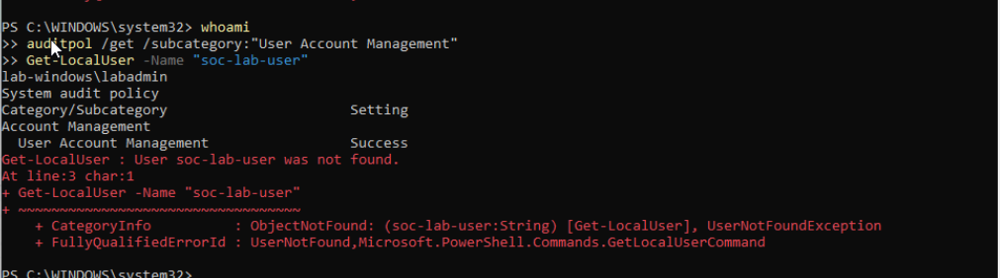
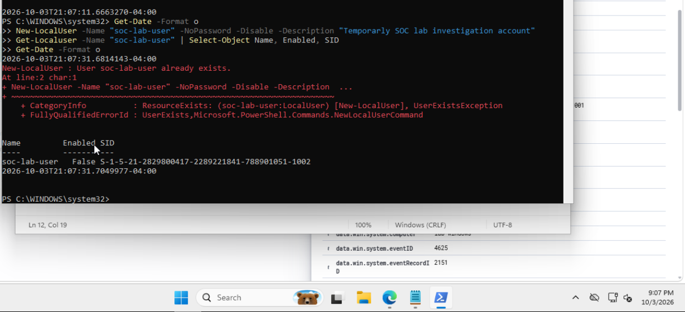
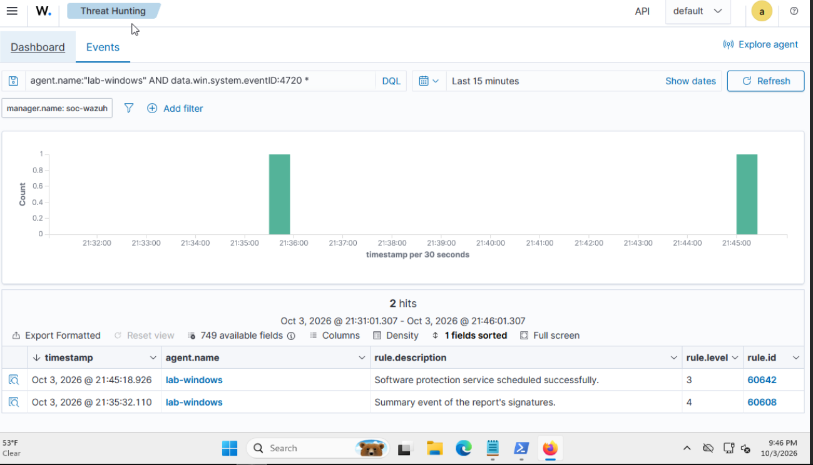
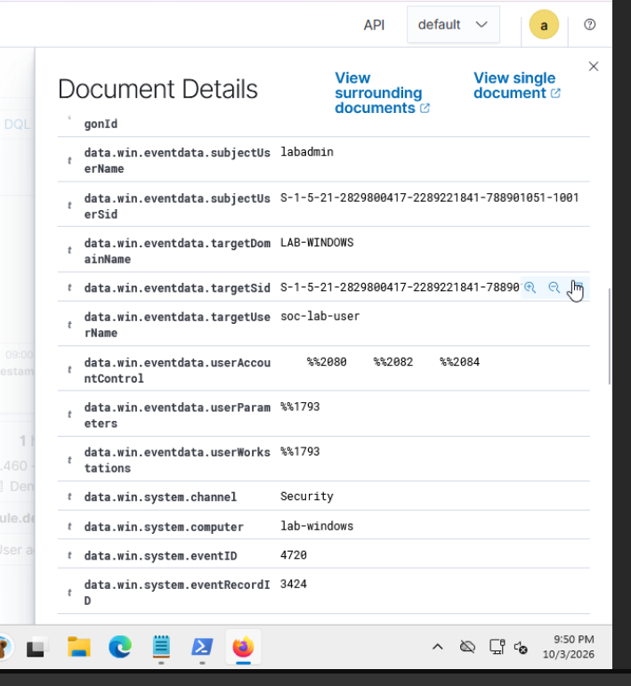
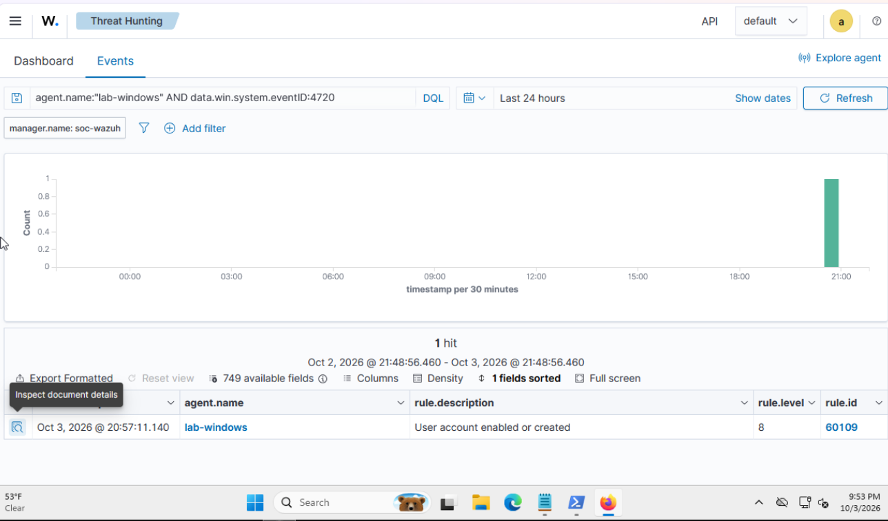
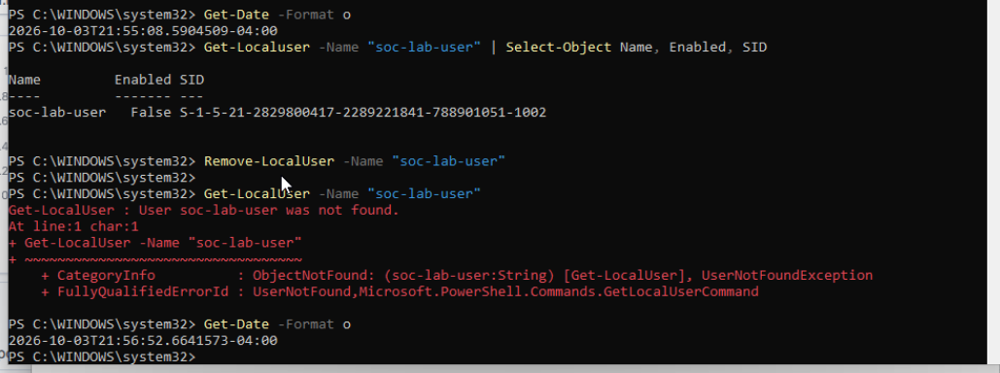
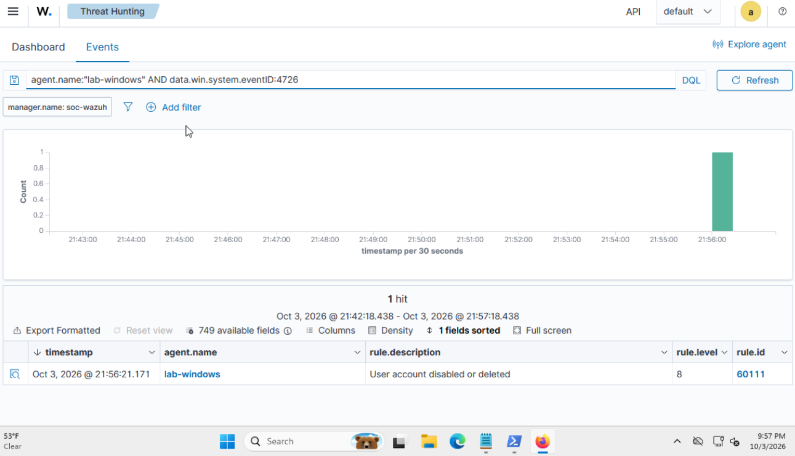
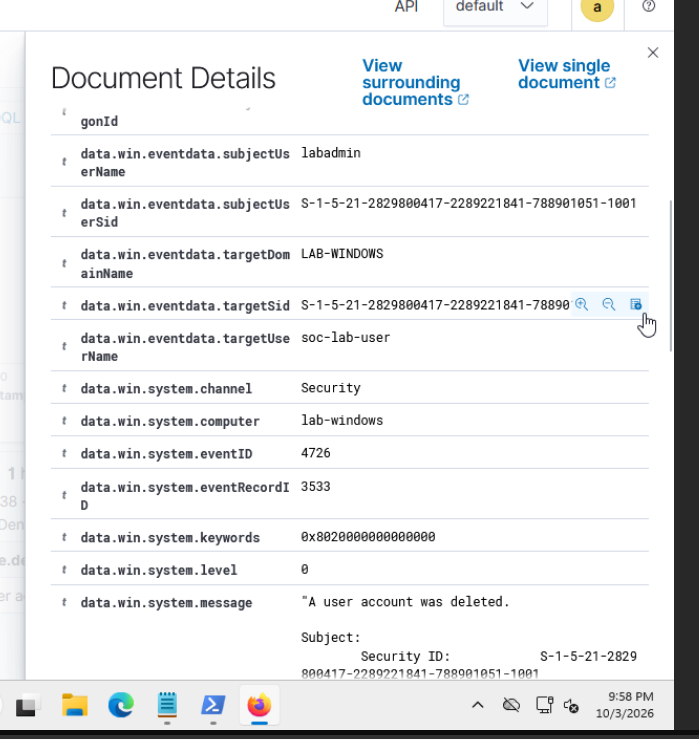

# Investigation 07: Windows account creation and deletion

**Activity date:** October 3, 2026  
**Endpoint:** `lab-windows`  
**Acting account:** `LAB-WINDOWS\labadmin`  
**Temporary account:** `soc-lab-user`  
**Disposition:** Close as expected, authorized lab activity. Account removal verified.

## What I investigated

I created a temporary, disabled local account on my Windows endpoint, reviewed the creation event in Wazuh, then deleted the account and verified cleanup. The exercise helped me distinguish the account performing an action from the account affected by it.

## How I worked through it

### 1. Check the audit policy and account name

In an elevated PowerShell window, I checked my identity, account-management auditing, and whether the test account already existed:

```powershell
whoami
auditpol /get /subcategory:"User Account Management"
Get-LocalUser -Name "soc-lab-user"
```

The output showed `lab-windows\labadmin`, Success auditing, and “User soc-lab-user was not found.” No audit-policy change was needed.



### 2. Create the temporary account and check its state

The exercise used this command to create a disabled account without a password:

```powershell
New-LocalUser -Name "soc-lab-user" -NoPassword -Disabled -Description "Temporary SOC lab investigation account"
Get-LocalUser -Name "soc-lab-user" | Select-Object Name, Enabled, SID
```

My captured execution at 21:07 returned “User soc-lab-user already exists.” That execution did not create a new account. The lookup confirmed the existing account was disabled and had SID `S-1-5-21-2829800417-2289221841-788901051-1002`.

I did not capture the original successful creation command. The creation event reviewed below places the earlier action at approximately 20:57. I kept the failed repeat in the evidence instead of presenting it as a successful creation.



### 3. Correct the Wazuh search

My first search included an extra asterisk and used Last 15 minutes. It displayed unrelated service and signature-report alerts. The time window also excluded the earlier account activity, so those results were not evidence of creation.



I removed the trailing asterisk, selected Last 24 hours, and searched:

```text
agent.name:"lab-windows" AND data.win.system.eventID:4720
```

### 4. Identify the acting and affected accounts

The expanded Windows Security event showed:

| Field | Value |
|---|---|
| Computer | `lab-windows` |
| Event ID | `4720` — user account created |
| Event record ID | `3424` |
| Subject user | `labadmin` |
| Subject SID | Ends in `1001` |
| Target user | `soc-lab-user` |
| Target domain | `LAB-WINDOWS` |

The subject identifies the acting security account; the target identifies the account created. The target SID was clipped in the dashboard screenshot, so I did not claim a full SID comparison with the terminal lookup.



The matching results row showed October 3 at **20:57:11.140**, rule **60109**, level **8**, with description “User account enabled or created.” Event 4720 establishes creation; that broader rule description does not establish that the account was enabled. The endpoint lookup showed `Enabled: False`.



### 5. Delete the account and verify it is absent

I ran each command separately so the output and timestamps were visible:

```powershell
Get-Date -Format o
Get-LocalUser -Name "soc-lab-user" | Select-Object Name, Enabled, SID
Remove-LocalUser -Name "soc-lab-user"
Get-LocalUser -Name "soc-lab-user"
Get-Date -Format o
```

The account existed and was disabled before removal. After `Remove-LocalUser`, the lookup returned “User soc-lab-user was not found.” The terminal timestamps bracket the cleanup between **21:55:08.5904509-04:00** and **21:56:52.6641573-04:00**.

This verifies removal of the local account. I did not investigate profile or file remnants, and this exercise did not test logging in as the temporary account.



### 6. Verify the deletion detection

I searched Wazuh for:

```text
agent.name:"lab-windows" AND data.win.system.eventID:4726
```

The result showed October 3 at **21:56:21.171**, rule **60111**, level **8**, described as “User account disabled or deleted.” This timestamp falls inside the terminal cleanup interval.



The expanded Security event showed **4726**, record **3533**, subject `labadmin`, target `soc-lab-user`, and computer `lab-windows`. Its message states “A user account was deleted.” These details distinguish deletion from disabling. Again, the target SID was clipped, so the documented correlation uses the endpoint, account name, event type, and timing rather than a full dashboard SID match.



### 7. Write the closing assessment

**Activity:** The temporary account `soc-lab-user` was created and deleted on `lab-windows`. A lookup before cleanup showed it was disabled.

**Evidence:** Creation event 4720, record 3424, triggered Wazuh rule 60109 at level 8 at 20:57:11.140. Deletion event 4726, record 3533, triggered rule 60111 at level 8 at 21:56:21.171. Dashboard times are recorded as displayed on October 3, 2026; the terminal timestamps explicitly use UTC-04:00.

**Authorization:** I intentionally performed these actions as part of my planned lab exercise. The subject account `labadmin` identifies who performed the actions in the logs; it does not establish approval by itself.

**Cleanup and disposition:** The post-deletion `Get-LocalUser` lookup reported the account was not found, and Wazuh received the deletion event. Close as expected, authorized lab activity with no escalation needed. This is a valid detection of benign test activity, rather than a false positive. This is my documented disposition; the evidence does not show a Wazuh alert-status change.

## What I learned

A successful command, an administrator account, and a completed cleanup do not prove authorization. I need the planned-test context for that conclusion. I also need to read the underlying Windows event instead of relying only on a rule description that covers multiple actions.

## References

- [Microsoft: Event 4720 — user account created](https://learn.microsoft.com/en-us/previous-versions/windows/it-pro/windows-10/security/threat-protection/auditing/event-4720)
- [Microsoft: Event 4726 — user account deleted](https://learn.microsoft.com/en-us/previous-versions/windows/it-pro/windows-10/security/threat-protection/auditing/event-4726)
- [Microsoft: New-LocalUser](https://learn.microsoft.com/en-us/powershell/module/microsoft.powershell.localaccounts/new-localuser)
- [Microsoft: Remove-LocalUser](https://learn.microsoft.com/en-us/powershell/module/microsoft.powershell.localaccounts/remove-localuser)
