# Investigation 08: Windows Administrators group membership

**Date:** October 5, 2026  
**Endpoint:** `lab-windows`, Wazuh agent `002`  
**Acting account:** `LAB-WINDOWS\labadmin`  
**Test account:** `soc-lab-admin`  
**Disposition:** Close as expected, authorized lab activity. Membership removal and account cleanup verified.

## What I investigated

I added a disabled local test account to Administrators, reviewed the Windows event in Wazuh, then removed the membership and deleted the account. I matched the event's member SID to the account rather than relying only on an alert description.

## Account versus group

| Item | Meaning in this exercise |
|---|---|
| `labadmin` | Account used to perform the changes |
| `soc-lab-admin` | Temporary account affected by the changes |
| `Administrators` | Group associated with administrative permissions |

An account is like a badge; group membership puts that badge on an access list. Removing it from the list does not delete the badge. I treated account creation, membership addition, membership removal, and account deletion as separate actions.

## How I worked through it

### 1. Check the prerequisites

In elevated PowerShell, I checked my identity, Success auditing for Security Group Management, whether the test account existed, and the Administrators group:

```powershell
whoami
auditpol /get /subcategory:"Security Group Management"
Get-LocalUser -Name "soc-lab-admin"
Get-LocalGroup -SID "S-1-5-32-544"
```

The output identified `lab-windows\labadmin`, showed Success auditing enabled, and reported the test account was not found. SID `S-1-5-32-544` identified Administrators. I did not change the audit policy.

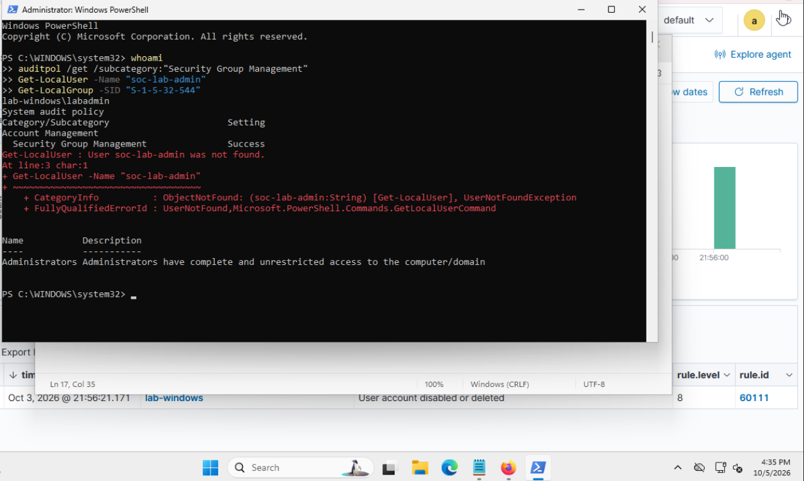

### 2. Resolve the PowerShell input issue

My initial input stayed at a `>>` continuation prompt and several commands were incomplete. The screenshot did not demonstrate execution or a successful membership change.

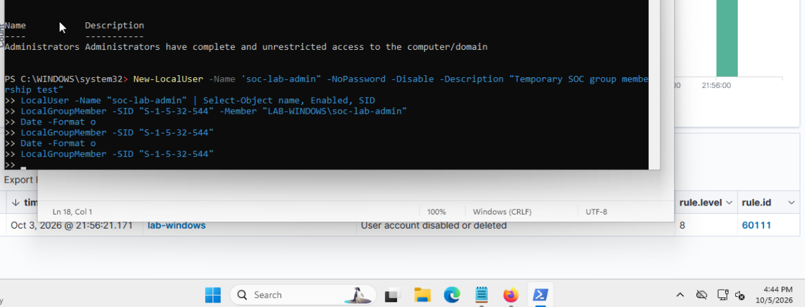

An early event 4732 search returned no results. At that point, I had no verified membership addition, so this was not evidence of a detection failure.

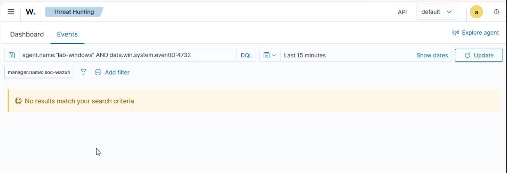

I checked again: the account was absent, and the next creation input was still waiting at `>>`. I canceled unfinished input with Ctrl+C and submitted commands individually. The evidence establishes that this resolved the input problem; it does not establish its exact keyboard or clipboard cause.

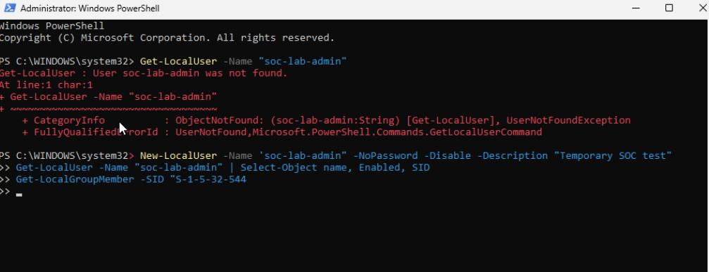

### 3. Create a disabled account and record the baseline

The successful creation command was:

```powershell
New-LocalUser -Name "soc-lab-admin" -NoPassword -Disabled -Description "Temporary SOC test"
Get-LocalUser -Name "soc-lab-admin" | Select-Object Name, Enabled, SID
Get-LocalGroupMember -SID S-1-5-32-544
```

The result showed `Enabled: False` and SID `S-1-5-21-2829800417-2289221841-788901051-1003`. The Administrators baseline contained only `LAB-WINDOWS\Administrator` and `LAB-WINDOWS\labadmin`.

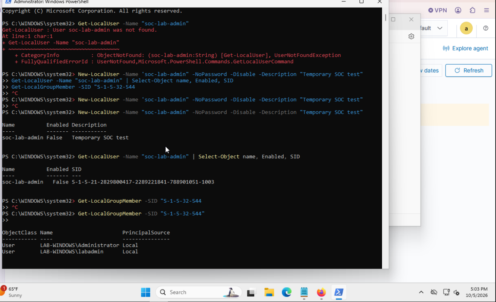

### 4. Add membership and find the alert

The exercise used this command:

```powershell
Add-LocalGroupMember -SID S-1-5-32-544 -Member LAB-WINDOWS\soc-lab-admin
```

The supplied screenshots do not capture the successful add command or its surrounding timestamps. I verified its resulting membership with the endpoint lookup and Windows event instead.

In Wazuh Threat Hunting, I searched:

```text
agent.name:"lab-windows" AND data.win.system.eventID:4732
```

The result showed **17:06:25.160**, Wazuh **rule 60154**, **level 12**, “Administrators Group Changed.” This severity did not establish compromise.

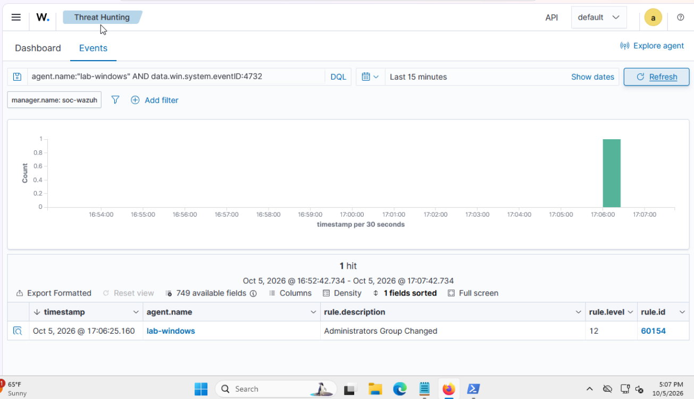

The expanded Security event was **4732**, record **5469**, on `lab-windows`. It named subject `labadmin` and target group `Administrators`, with target SID `S-1-5-32-544`. The message described a member being added to a local security group.

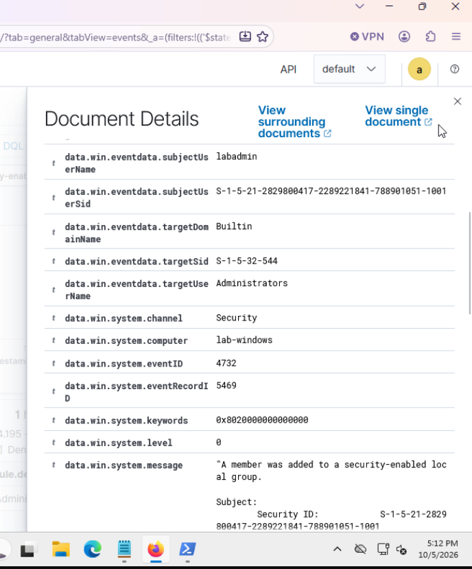

### 5. Match the added member to the account

A fresh PowerShell lookup showed that `soc-lab-admin` remained disabled and appeared in Administrators alongside the two original members.

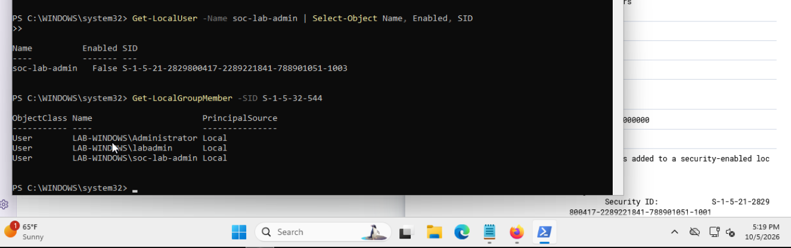

The table view exposed `memberSid`, but clipped the end. I did not claim a full match from that partial value.

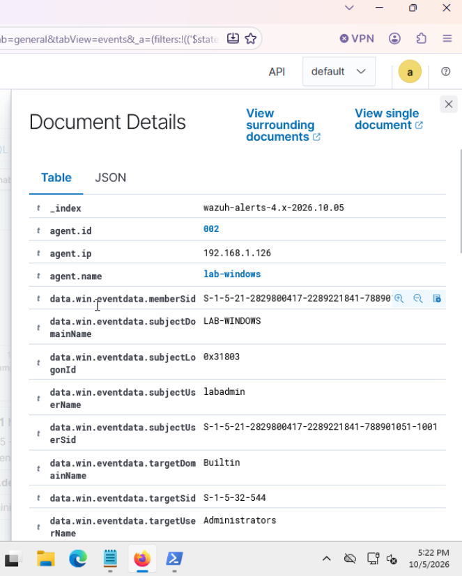

Switching to JSON revealed the complete member SID: `S-1-5-21-2829800417-2289221841-788901051-1003`. It exactly matched the endpoint account SID, linking the addition event to `soc-lab-admin`.

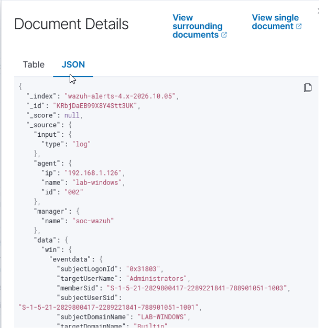

### 6. Remove membership and verify the removal event

I removed only the test account's membership, then listed the group:

```powershell
Get-Date -Format o
Remove-LocalGroupMember -SID S-1-5-32-544 -Member LAB-WINDOWS\soc-lab-admin
Get-LocalGroupMember -SID S-1-5-32-544
Get-Date -Format o
```

The timestamps bracketed the removal between **17:25:33.2167886-04:00** and **17:26:23.7864425-04:00**. The group list returned to its original two members.

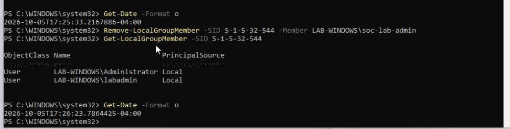

Wazuh received Security event **4733**, record **5503**, identifying `labadmin` as the subject and Administrators as the target group. Its message stated that a member was removed.

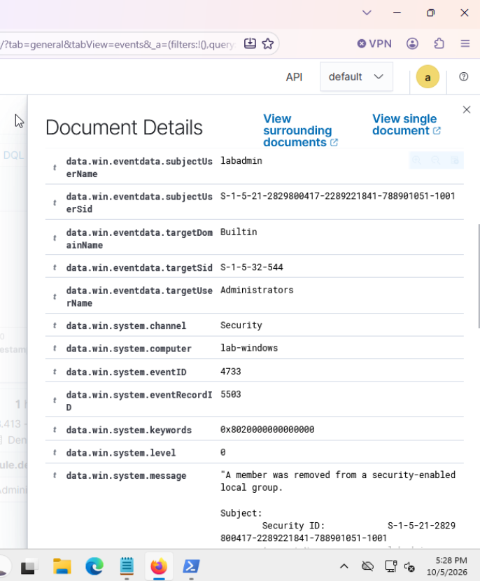

The removal JSON showed the same complete member SID ending in `1003`. This linked the removal to the same test account as the addition.

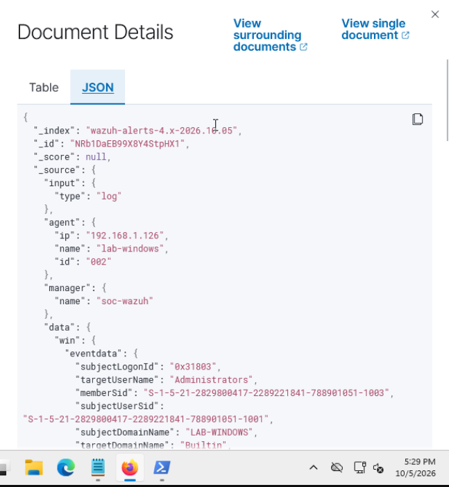

### 7. Delete the account and document the conclusion

After verifying membership removal, I deleted the temporary account:

```powershell
Remove-LocalUser -Name soc-lab-admin
Get-LocalUser -Name soc-lab-admin
Get-LocalGroupMember -SID S-1-5-32-544
```

The account lookup returned “User soc-lab-admin was not found.” I initially mistyped the membership command as `Get-LocalUserMember`; that failed. The corrected `Get-LocalGroupMember` command showed only the original members. This verifies local account absence and the final group state. No account-deletion event 4726 was captured for this investigation.

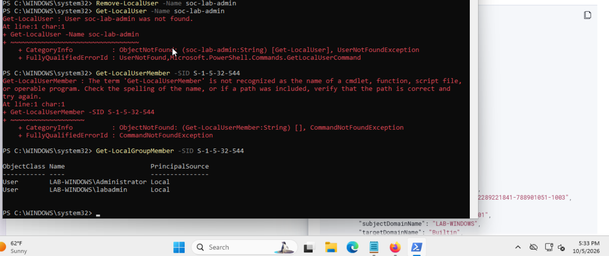

The removal results row showed **17:25:56.269**, rule **60154**, level **12**. Its timestamp falls within the terminal removal interval. The same Wazuh rule detected both directions; events 4732 and 4733 distinguished addition from removal.

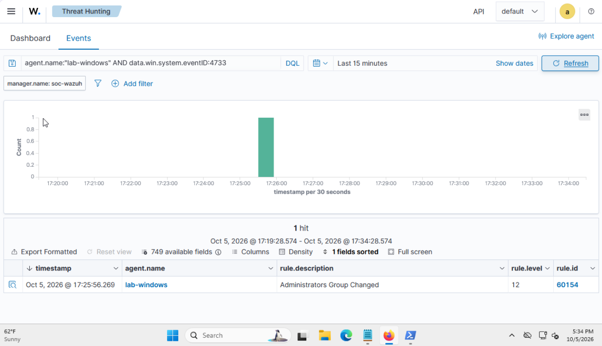

## Timeline

Dashboard timestamps are shown as displayed on October 5, 2026. The removal terminal timestamps explicitly use UTC-04:00.

| Action | Evidence | Time |
|---|---|---|
| Membership added | Event 4732, record 5469; rule 60154, level 12 | 17:06:25.160 |
| Membership removed | Event 4733, record 5503; rule 60154, level 12 | 17:25:56.269 |
| Account deleted | Remove-LocalUser followed by account-not-found lookup | Exact command time not captured |

## Closing assessment

**Activity:** `labadmin` added disabled account `soc-lab-admin` to Administrators on `lab-windows`, then removed its membership and deleted the account.

**Evidence:** The complete member SID matched the test account in both event 4732 and event 4733. Endpoint group listings verified the before, added, and removed states. Both changes triggered Wazuh rule 60154 at level 12.

**Impact:** The account held Administrators membership while disabled. I did not demonstrate successful sign-in, use of administrator privileges, compromise, or revocation of privileges from existing sessions.

**Authorization:** I intentionally performed these changes as part of my planned lab exercise. The logged acting account identifies the security context; it does not prove approval by itself.

**Cleanup and disposition:** Administrators returned to its original two members. After account deletion, Get-LocalUser reported the account was not found. Close as expected, authorized lab activity without escalation. This is a valid detection of benign test activity, rather than a false positive. This is my written disposition; the screenshots do not demonstrate changing an alert status in Wazuh.

## What I learned

I initially confused account creation with group membership. Event 4732 adds an existing identity to a group; it does not create the identity. Event 4733 removes membership; it does not delete the account. Comparing full SIDs and verifying the resulting endpoint state gave me a stronger conclusion than relying on names, severity, or a generic alert description.

## References

- [Microsoft: Event 4732 — member added to a local security group](https://learn.microsoft.com/en-us/previous-versions/windows/it-pro/windows-10/security/threat-protection/auditing/event-4732)
- [Microsoft: Event 4733 — member removed from a local security group](https://learn.microsoft.com/en-us/previous-versions/windows/it-pro/windows-10/security/threat-protection/auditing/event-4733)
- [Microsoft: Add-LocalGroupMember](https://learn.microsoft.com/en-us/powershell/module/microsoft.powershell.localaccounts/add-localgroupmember)
- [Microsoft: Remove-LocalGroupMember](https://learn.microsoft.com/en-us/powershell/module/microsoft.powershell.localaccounts/remove-localgroupmember)
