# Investigation 09: Sysmon process creation and Wazuh delivery

**Dates:** October 6–7, 2026  
**Endpoint:** `lab-windows`, Wazuh agent `002`  
**Acting account:** `LAB-WINDOWS\labadmin`  
**Disposition:** Close as expected, authorized lab activity. Temporary JSON archiving disabled and manager restarted.

## What I investigated

I installed Sysmon, configured the Wazuh agent to collect its Windows event channel, and traced a marked process creation event through the manager, saved alerts, and dashboard. An empty dashboard search initially left delivery unproven. I checked each stage rather than assuming an active agent meant the event had arrived.

Think of this as tracking a package: a running delivery service is not a receipt for a particular package. I needed the same marker in the endpoint activity and manager records.

## Artifacts used in my assessment

| Artifact | Observed value | What it supports |
|---|---|---|
| Endpoint and agent | `lab-windows`, `002`, IP `192.168.1.126` | Source of the event |
| Account | `LAB-WINDOWS\labadmin` | Logged security context, not approval by itself |
| Provider and event | `Microsoft-Windows-Sysmon`, event ID `1`, record `1053` | Process creation recorded by Sysmon |
| Process and parent | `C:\Windows\System32\cmd.exe`; parent `powershell.exe` | PowerShell launched a Windows command shell |
| Command marker | `SOC-SYSMON-DELIVERY-TEST` | Links the record to my controlled test |
| Process identifiers | PID `3008`, parent PID `8712`; process GUID `{23341b07-634b-6ac5-7f04-000000000600}` | Additional correlation fields; PIDs alone can be reused |
| Wazuh detection | Rule `92004`, level `4` | Specific process behavior qualified for a saved alert |
| Manager alert timestamp | `2026-10-07T02:08:30.637+0000` | Matches dashboard October 6, `22:08:30.637` in New York |
| Endpoint event UTC time | `2026-10-06 21:08:27.970` | Approximately five hours earlier than manager timestamp; clock alignment was not verified |
| Cleanup | `logall_json` set to `no`; restart followed by `active` | Temporary raw JSON archiving was disabled |

The endpoint and manager times differ. I correlated the marker, process GUID, and event fields rather than treating their timestamps as synchronized. The earlier dashboard window ended at 17:15; a later window ended at 22:18 and included the alert. The screenshots do not establish why that changed.

## How I worked through it

### 1. Install Sysmon and verify local collection

I extracted the Microsoft Sysmon download to `C:\Users\labadmin\Downloads\Sysmon` and installed the x64 executable in elevated PowerShell:

```powershell
Set-Location "$env:USERPROFILE\Downloads\Sysmon"
.\Sysmon64.exe -i
Get-Service Sysmon64
```

The screenshots show Sysmon version 15.22 installed and its service running. I launched Notepad and checked local process events:

```powershell
notepad.exe
Get-WinEvent -FilterHashtable @{LogName='Microsoft-Windows-Sysmon/Operational'; Id=1} -MaxEvents 5 | Format-List TimeCreated, Id, Message
```

This proved local collection. The displayed packaged Notepad event had another Notepad process as its parent; it did not demonstrate a direct PowerShell-to-Notepad relationship. Notepad was an initial check, separate from the marked command test below.

### 2. Add the Wazuh collection entry

The agent was running, but my initial local configuration search did not show a Sysmon entry. I added this block before the existing closing `</ossec_config>` tag, outside other sections:

```xml
<localfile>
  <location>Microsoft-Windows-Sysmon/Operational</location>
  <log_format>eventchannel</log_format>
</localfile>
```

After restarting `WazuhSvc`, its log reported “Analyzing event log” for the Sysmon channel. This showed the collection entry loaded, not delivery of a specific event. The connection log and a successful TCP test to `192.168.1.151:1514` supported connectivity, but were not event receipts.

### 3. Inspect the rule and alert threshold

On `soc-wazuh`, I checked the installed rules and configuration:

```bash
sudo grep -A 7 'id="61603"' /var/ossec/ruleset/rules/0595-win-sysmon_rules.xml
sudo grep -nE 'log_alert_level|logall_json' /var/ossec/etc/ossec.conf
```

The base Sysmon event 1 rule `61603` was level `0`, while the minimum alert level was `3`. JSON archiving was disabled. An event matching only that base rule would not qualify for a saved alert. This did not mean every Sysmon process event would stay at level 0: a more specific rule could match, as our marked test later demonstrated.

### 4. Temporarily enable raw JSON archiving

I set the existing `logall_json` value to `yes` in `/var/ossec/etc/ossec.conf`. My first search failed because `archives.json` did not exist. A saved setting and an active manager were insufficient to establish that the running service had loaded the change.

After restarting the manager, I verified `active` and that `/var/ossec/logs/archives/archives.json` existed. I used this temporary archive to inspect received events without depending on dashboard visibility. I did not change the global alert threshold or built-in rules.

### 5. Generate and trace the marked command

On `lab-windows`, I ran:

```powershell
cmd.exe /c "echo SOC-SYSMON-DELIVERY-TEST"
```

On the manager, I searched:

```bash
sudo grep -F 'SOC-SYSMON-DELIVERY-TEST' /var/ossec/logs/archives/archives.json | tail -n 3
```

The matching record identified agent `002`, Sysmon event `1`, the test command, and PowerShell as the parent of `cmd.exe`. It matched rule `92004`, level `4`, “Powershell process spawned Windows command shell instance.” This proved receipt and showed that a specific rule superseded the level-0 base match.

### 6. Separate saved alerts from dashboard visibility

My initial broad marker search in `alerts.json` returned rule `5402` on manager agent `000`: it logged my own sudo search command. Finding the marker alone was not enough. I narrowed the search:

```bash
sudo grep -F '"id":"92004"' /var/ossec/logs/alerts/alerts.json | grep -F 'SOC-SYSMON-DELIVERY-TEST' | tail -n 1
```

That returned the actual Windows Sysmon alert. Filebeat was active, but service status alone did not prove forwarding succeeded.

I searched the dashboard:

```text
agent.name:"lab-windows" AND rule.id:"92004"
```

The earlier window returned no results. A later Last 24 hours window ending at 22:18 showed three results. The newest row at 22:08:30.637 matched the saved alert. Expanding it showed the exact test marker and process details. I did not infer three malicious actions or three distinct manual attempts from the count.

### 7. Disable temporary archiving

I restored the existing setting to:

```xml
<logall_json>no</logall_json>
```

Then I restarted and verified the manager:

```bash
sudo systemctl restart wazuh-manager
sudo grep -n 'logall_json' /var/ossec/etc/ossec.conf
sudo systemctl is-active wazuh-manager
```

The final screenshot shows `no` and `active` after the restart. This disables future raw JSON archiving; it does not delete previously written archives. Sysmon and normal Wazuh alert collection remained configured.

## Closing assessment

**Activity:** PowerShell launched `cmd.exe` on `lab-windows` to print my test marker. This was the marked test, not the earlier Notepad check.

**Evidence:** Sysmon event 1, record 1053, contained the command marker, account, process GUID, and parent process. The manager archive, saved rule 92004 alert at level 4, and expanded dashboard event supported the same activity.

**Authorization:** I intentionally performed this planned test on my own lab endpoint. An account name or a lab location alone would not establish approval for other activity.

**Impact and limits:** The test demonstrated command-shell process visibility. It did not demonstrate compromise, malicious PowerShell, persistence, or complete Sysmon coverage. The MITRE technique label describes behavior, not proof of an attack. Clock synchronization remains unverified.

**Cleanup and disposition:** Temporary JSON archiving was disabled and the manager restarted successfully. Close as expected, authorized lab activity without escalation. This is my documented assessment, not evidence of changing an alert's status in the dashboard. The detection accurately described benign test behavior.

## What I learned

I learned that a running agent and an empty dashboard search do not tell the whole story. I traced the same test marker through the manager archive, saved alert, and dashboard to verify each stage. The base Sysmon rule was level 0, but our PowerShell-to-command-shell activity matched a more specific rule at level 4. I also caught a search that returned its own sudo activity instead of the Windows event. Checking the endpoint, command line, matched rule, and time range helped me connect my conclusion to the right evidence. This gave me practice troubleshooting monitoring and writing a supported assessment, rather than assuming an alert was missing or that a detection meant compromise.

## Screenshot evidence

All 24 screenshots supplied during this exercise are included below, including unsuccessful searches and repeated confirmations. They document what I could prove at each stage.

### Evidence 01: Extracted files

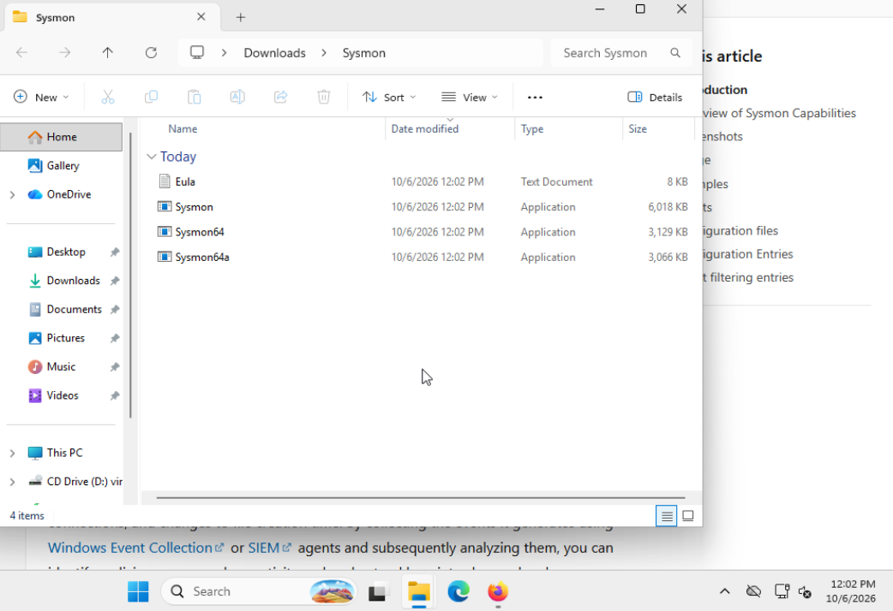

### Evidence 02: Installation service running

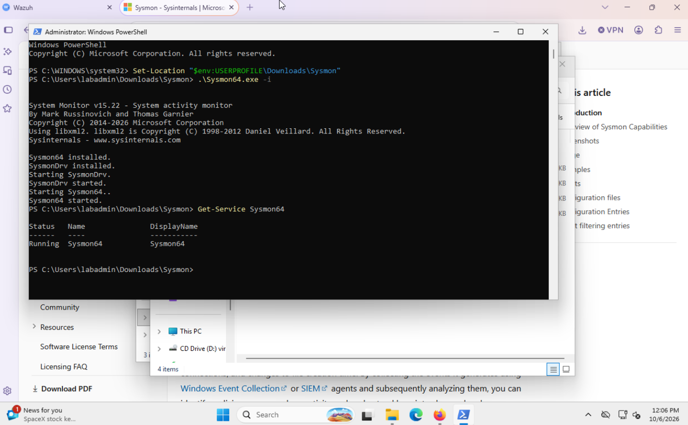

### Evidence 03: Local notepad process event

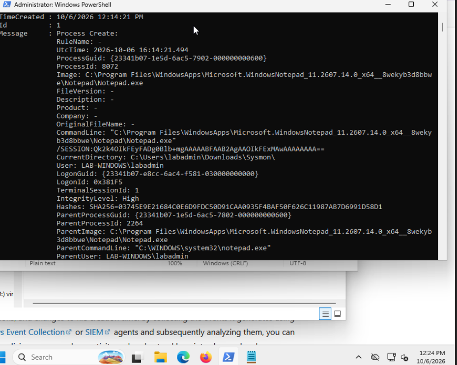

### Evidence 04: Agent running no local sysmon entry

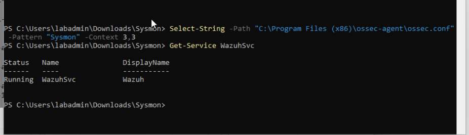

### Evidence 05: Sysmon localfile placement

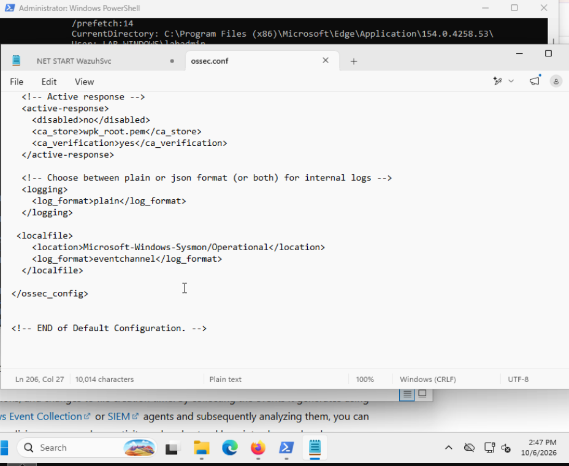

### Evidence 06: Empty dashboard search

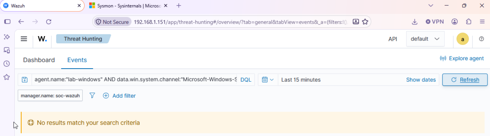

### Evidence 07: Agent analyzing sysmon channel

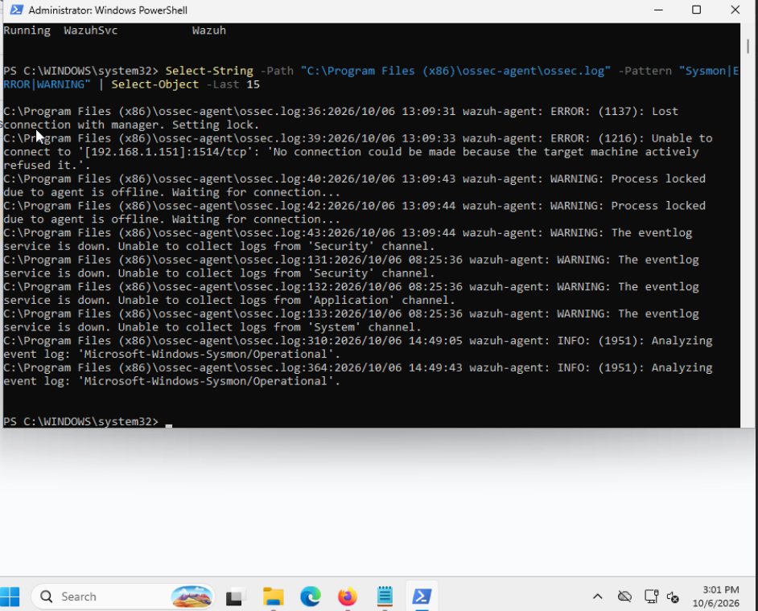

### Evidence 08: Manager port reachable

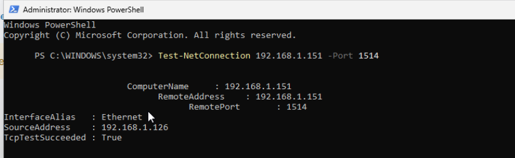

### Evidence 09: Agent connected manager

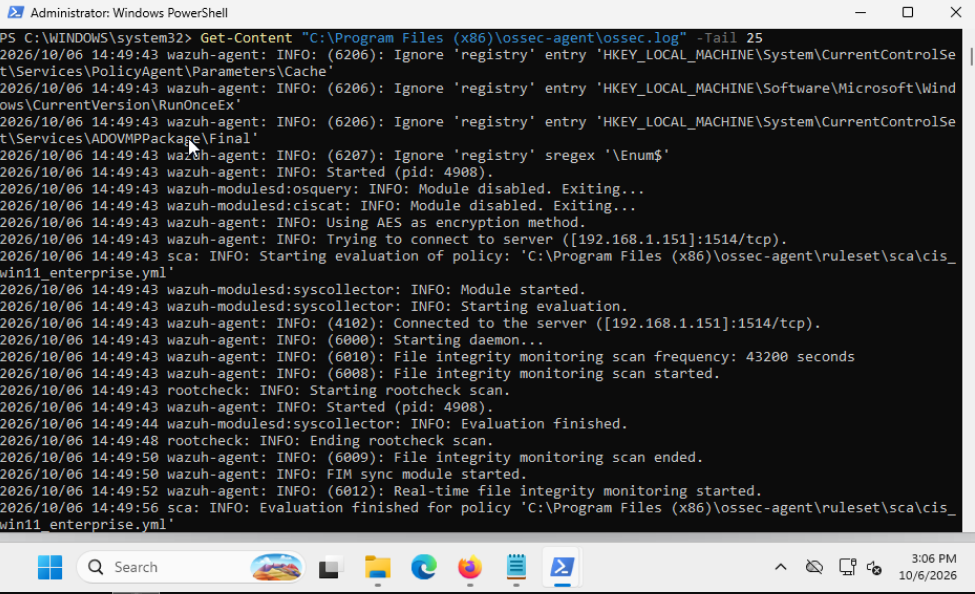

### Evidence 10: Empty provider search

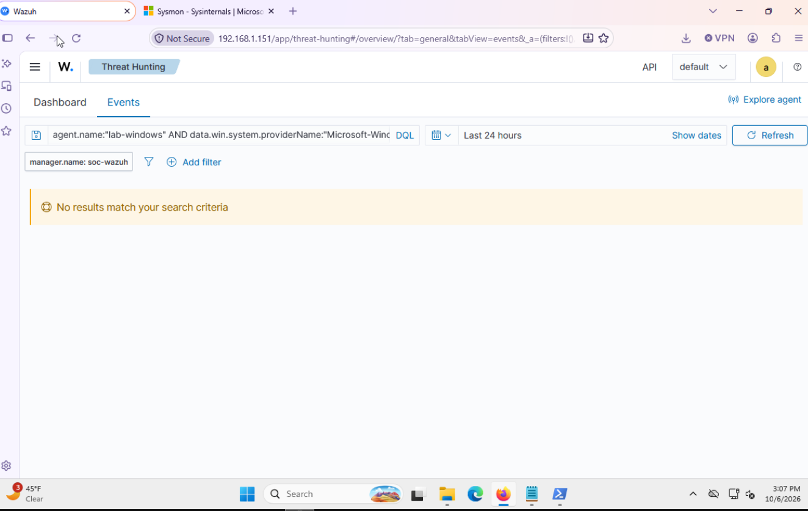

### Evidence 11: Sysmon rule and logging settings

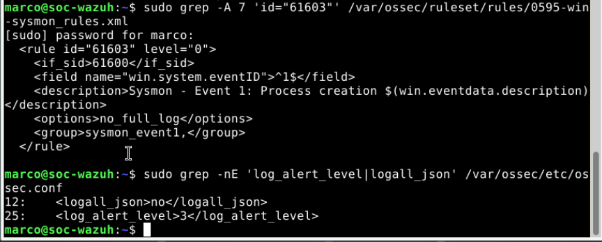

### Evidence 12: Archive file not found

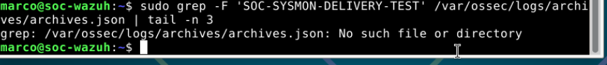

### Evidence 13: Archiving saved manager active json missing

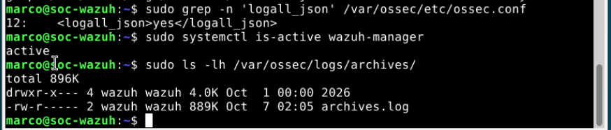

### Evidence 14: Manager restarted json archive created

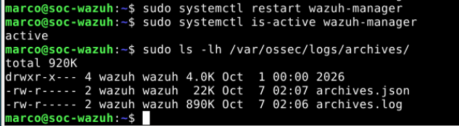

### Evidence 15: Json archive confirmation


### Evidence 16: Marked sysmon event received manager

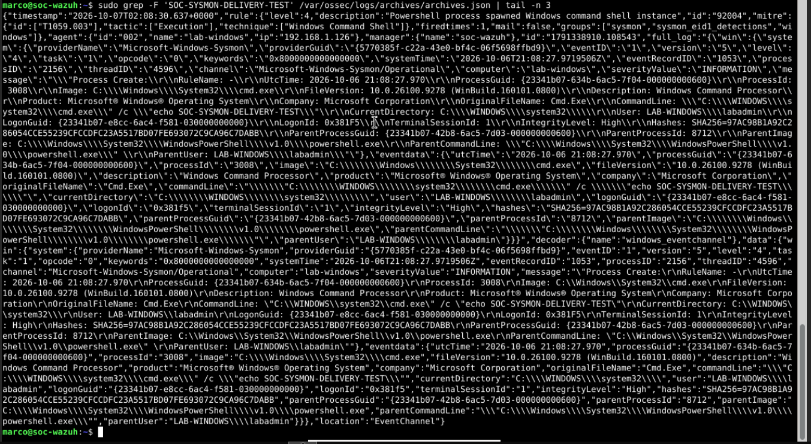

### Evidence 17: Dashboard rule92004 no results

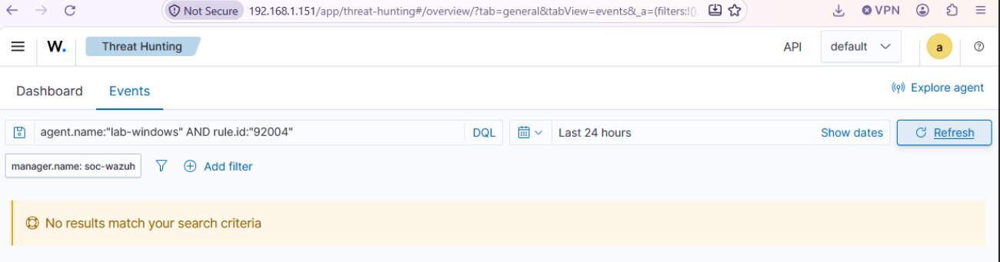

### Evidence 18: Search matched sudo alert filebeat active

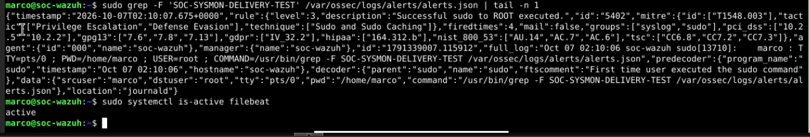

### Evidence 19: Dashboard windows alerts time window

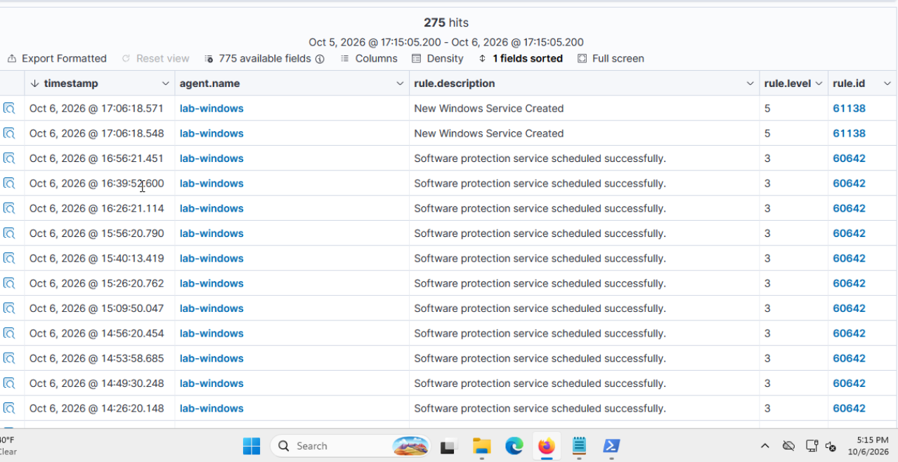

### Evidence 20: Marked sysmon saved alert rule92004

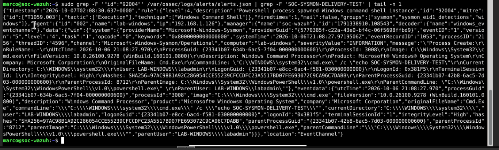

### Evidence 21: Dashboard rule92004 visible

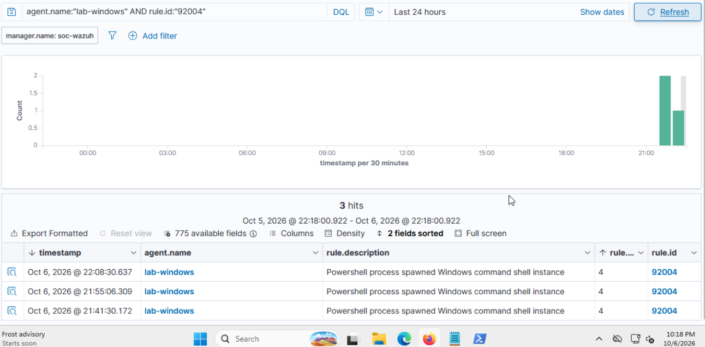

### Evidence 22: Dashboard test commandline confirmed

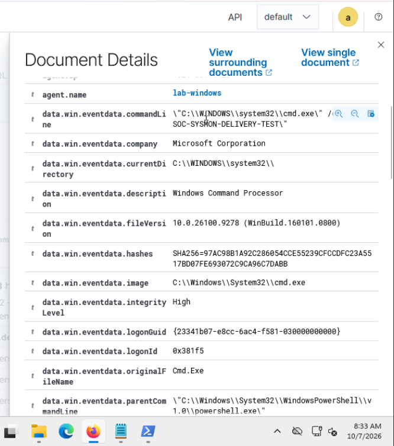

### Evidence 23: Raw archiving still enabled


### Evidence 24: Archiving disabled manager restarted active

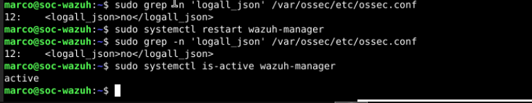

## References

- [Microsoft Sysmon](https://learn.microsoft.com/en-us/sysinternals/downloads/sysmon)
- [Wazuh event channel collection](https://documentation.wazuh.com/current/user-manual/capabilities/log-data-collection/configuration.html)
- [Wazuh event logging and archives](https://documentation.wazuh.com/current/user-manual/manager/event-logging.html)
- [Wazuh alert threshold](https://documentation.wazuh.com/current/user-manual/reference/ossec-conf/alerts.html)
