# Windows endpoint setup

**Started:** October 1, 2026  
**Status:** Windows endpoint enrolled and Active in Wazuh; Windows Security event collection verified on October 2, 2026.

## Resource check

Before creating the Windows VM, I checked the Proxmox node and VM storage. The node screenshot shows 13.29 GiB of 31.02 GiB RAM in use, about 17.73 GiB remaining at capture time, and 8 logical CPUs on an Intel Core i3-14100T. The displayed manager version is Proxmox VE 9.2.2. These observed CPU details take precedence over any earlier hardware assumptions; the screenshot does not identify the computer's chassis model.

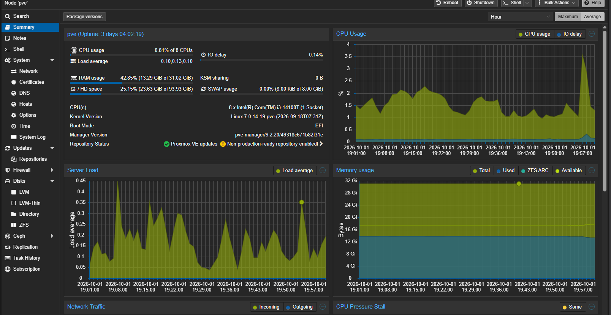

The local-lvm storage screenshot shows 72.75 GB used out of 875.49 GB, leaving approximately 802.74 GB at capture time. This is thin-pool usage, not a guarantee that all provisioned VM disks could fill simultaneously.

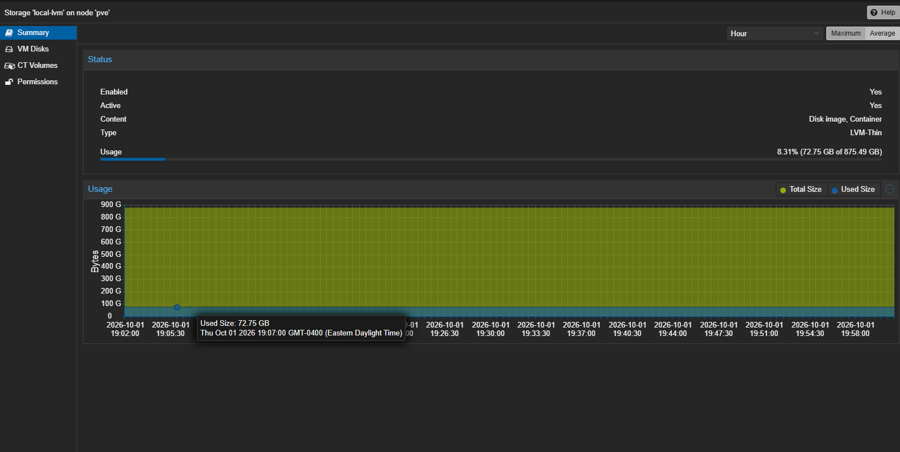

## Planned VM

- Name: `lab-windows`
- VM ID: `103`, if available
- 1 socket, 4 CPU cores, CPU type `host`
- 8192 MiB RAM
- 80 GiB virtual disk on local-lvm
- Lab bridge: vmbr1
- Windows 11 Enterprise Evaluation x64 with VirtIO drivers
- UEFI, q35, TPM 2.0, EFI disk with pre-enrolled keys

The user reported the upload was done. The two supplied screenshots establish resources; they do not show the ISO inventory or a created VM. Both screenshots are preserved unchanged.

## VM hardware verified

The Hardware page confirms VM `103 (lab-windows)` with 8 GiB RAM and ballooning disabled, 1 socket and 4 host-type CPU cores, OVMF UEFI, q35, VirtIO SCSI single, an 80 GiB SCSI disk with discard and IO thread enabled, and VirtIO networking on `vmbr1` with the firewall flag enabled. The EFI disk has pre-enrolled keys and the TPM state is version 2.0.

Both ISOs are attached: VirtIO `0.1.302` on `ide0` and Windows Enterprise Evaluation x64 English (`26300.9457…26h2…CLIENTENTERPRISEEVAL`) on `ide2`. These filenames identify attached media; they do not yet establish an installed Windows version. Boot order and QEMU agent options are not visible on this Hardware page.

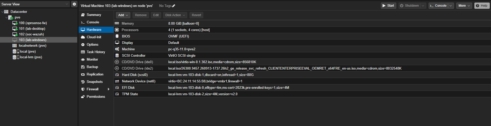

Next: boot the Windows installer and load the VirtIO SCSI driver if the virtual disk is not shown.

## Windows Setup disk detection

Windows Setup reached “Select location to install Windows 11,” but the disk list was empty. The virtual SCSI disk had already been confirmed in Proxmox Hardware. The next step was to load the VirtIO SCSI driver from the attached VirtIO ISO using Load Driver and the `vioscsi/w11/amd64` folder. Driver loading and disk visibility were not yet verified in this screenshot.

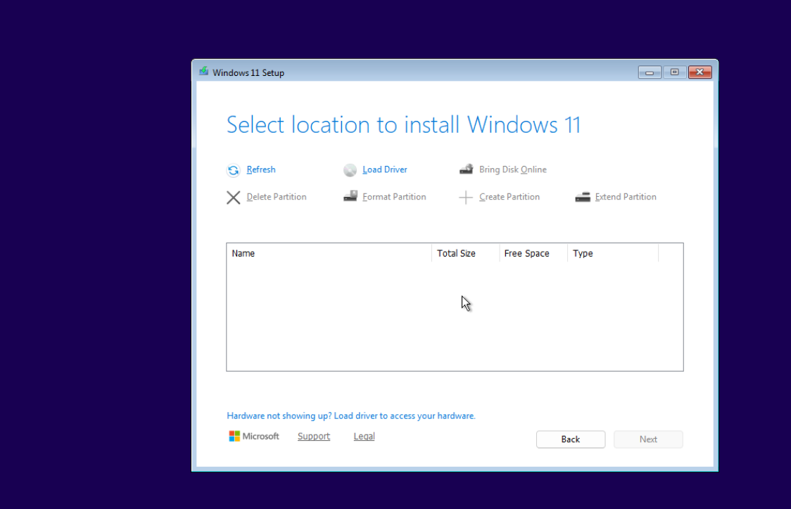

## Initial account setup

The next screenshot shows Windows initial setup asking “Who’s going to use this device?” with an empty name field. This establishes that installation advanced to account setup; it does not confirm network connectivity or completion of driver installation. The planned local administrative account name is `labadmin`, distinct from the VM/computer name `lab-windows`.

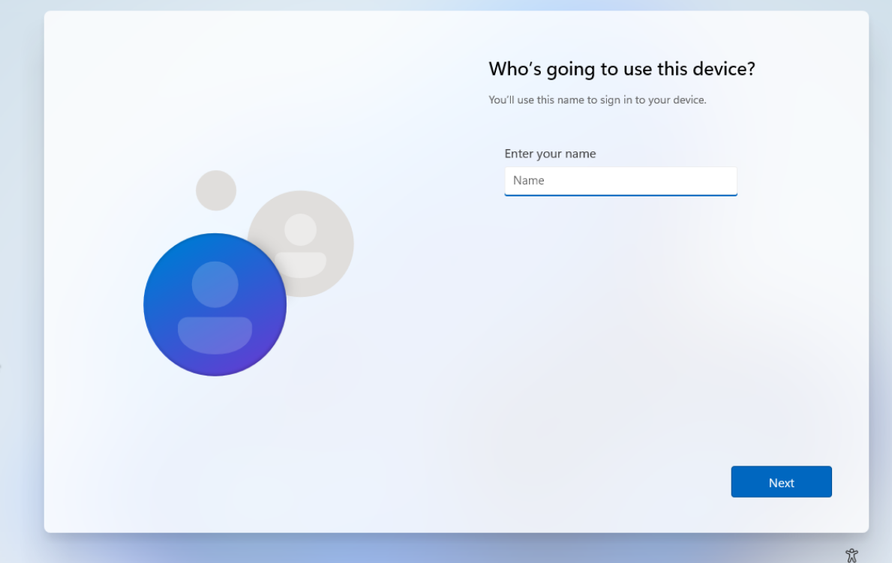

## Network driver selection

The next screenshot shows the initial network setup screen with the Install driver folder selector open. The VirtIO 0.1.302 CD is mounted as `D:`, the Windows installation CD as `E:`, and the installed system disk as `C:`. Network connectivity is not yet confirmed. The next step is to select `D:\NetKVM\w11\amd64` for the VirtIO network driver.

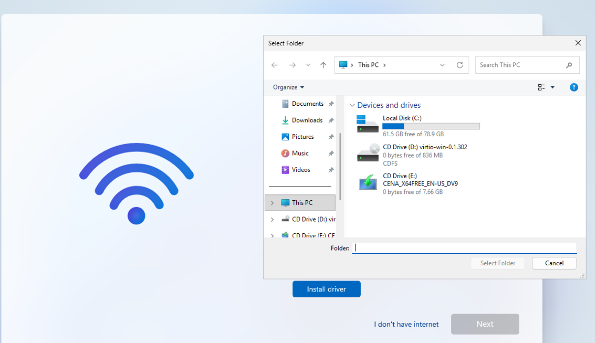

## Choosing the lab account setup path

Windows next displayed “Let’s set things up for your work or school,” with an empty organizational sign-in field and a Sign-in options link. No organizational credentials were entered in the supplied screenshot. The next step is to inspect Sign-in options for the local-account route (Domain join instead, if offered). This option does not itself join an Active Directory domain.

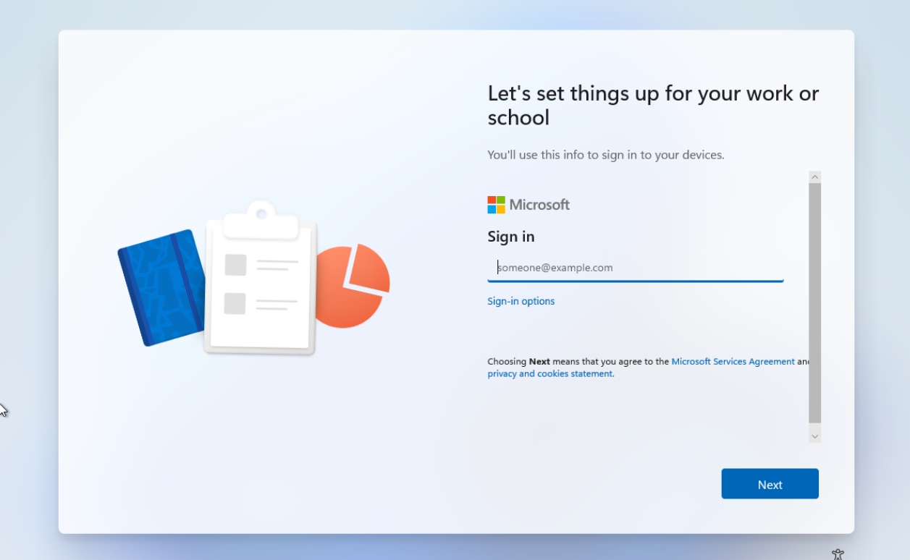

## Windows readiness checks

PowerShell confirms hostname `lab-windows`, IPv4 `192.168.1.126`, mask `255.255.255.0`, and gateway `192.168.1.1`. The QEMU-GA service is Running. `Test-NetConnection 192.168.1.151 -Port 1514` returns `TcpTestSucceeded: True`, with source address `192.168.1.126`. This establishes TCP connectivity to the Wazuh manager's agent communication port, not agent installation or enrollment. Windows Update completion has not yet been confirmed.

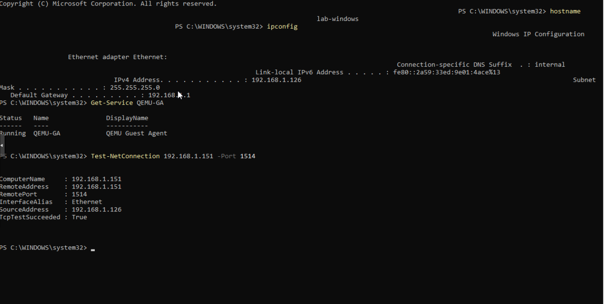

## Wazuh enrollment confirmed

On October 2, 2026, the endpoint dashboard shows `lab-windows` as agent `002`, IP `192.168.1.126`, group `default`, agent version `4.14.8`, and status Active. The reported OS is Microsoft Windows 11 Enterprise Evaluation `10.0.26300.9457`. The Debian endpoint is also Active as agent `001`; there are two Active endpoints and none disconnected or pending in the screenshot.

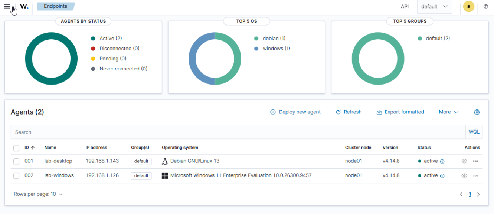

This confirms enrollment and current agent connectivity. It does not independently confirm Windows Update completion or collection of a specific Windows event channel. The supplied image does not show the installer command or Windows service output. Next: inspect received Windows events and take a working baseline snapshot.

## Windows event collection verified

I opened Threat Hunting and searched for `lab-windows`. The first screenshot shows 488 hits and an Add filter window; this alone did not identify a Windows event channel.

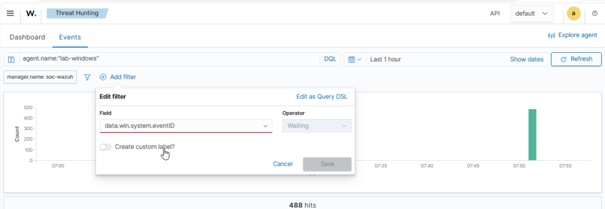

My first field-existence search omitted the colon before the asterisk and returned no results.

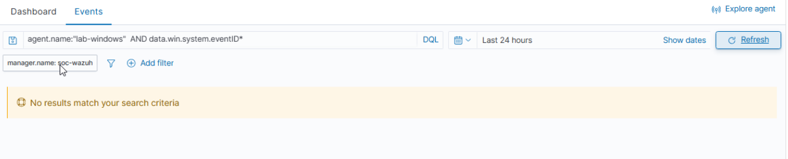

I corrected the query to `agent.name:"lab-windows" AND data.win.system.eventID:*`. With Last 24 hours selected, Wazuh displayed ten results, including successful logons and logoffs.

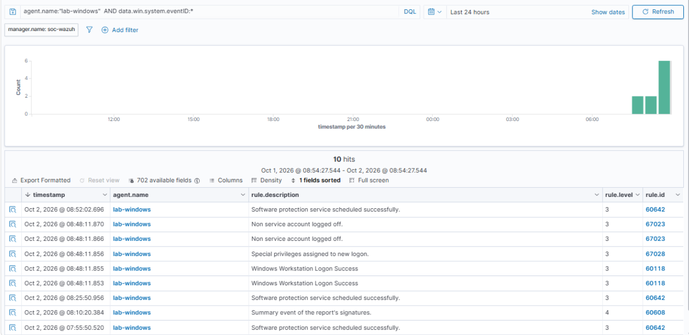

An expanded event showed event ID 4624, the Security-Auditing provider, and computer `lab-windows`.

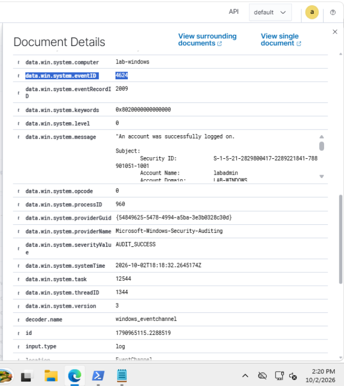

The event's target user was `labadmin` in `LAB-WINDOWS`, with logon type 2 and caller process `msedge.exe`. I verified the target account instead of relying only on the Subject field. The Edge process means I did not assume this event represented a fresh desktop sign-in.

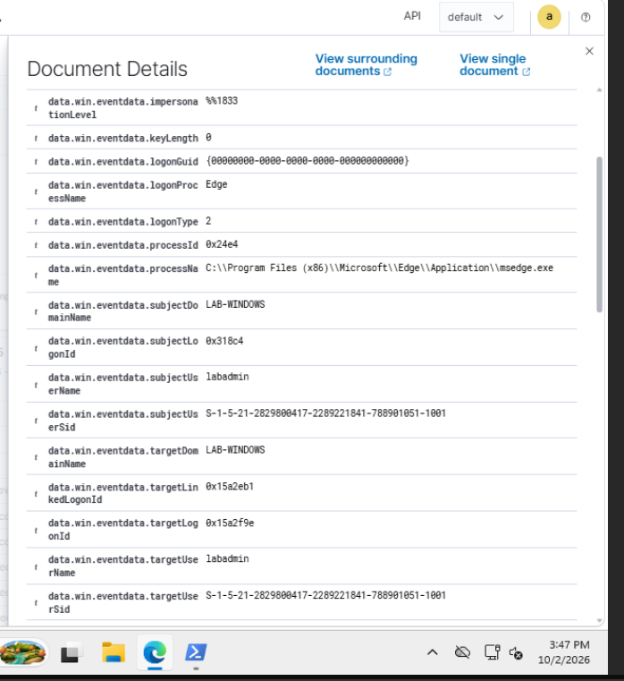

Windows Update completion and the proposed baseline snapshot were not confirmed in the supplied evidence. My next completed exercise was [Windows failed authentication](../investigations/06-windows-failed-logon.md).
